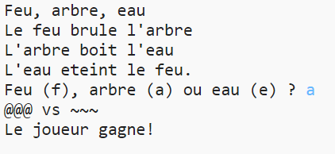

--- challenge ---
## Défi : Créer un nouveau jeu 

Saurais-tu ton propre jeu comme Pierre-feuille-ciseaux mais avec d'autres objets ?

Cliquer sur le bouton 'Duplicate' pour créer une copie de ton projet Pierre-feuille-ciseaux comme point de départ.

L'exemple suivant utilise le Feu, des Buches et de l'Eau (Fire, Logs & Water) :

--- /challenge ---