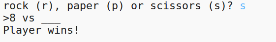

## परिचय

इस प्रोजेक्ट में आप एक "रॉक, पेपर, सिज़र" खेल बनाएंगे और कंप्यूटर के खिलाफ खेलेंगे।

नियम: आप और कंप्यूटर दोनों रॉक, पेपर या सिज़र (कैंची) चुन सकते हैं। विजेता इन नियमों से तय होता है:

* रॉक कैंची की धार कम कर देता है 
* पेपर रॉक को ढक देता है 
* कैंची कागज़ को काट देती है 

  <iframe src="https://trinket.io/embed/python/e1e1d873be?outputOnly=true&start=result" width="600" height="500" frameborder="0" marginwidth="0" marginheight="0" allowfullscreen>
  </iframe>
  

### क्लब लीडरों के लिए अतिरिक्त जानकारी

यदि आप इस प्रोजेक्ट को प्रिंट करना चाहते हैं, तो कृपया [प्रिंटर अनुकूल संस्करण](https://projects.raspberrypi.org/en/projects/rock-paper-scissors/print) का उपयोग करें।

## \--- collapse \---

## title: क्लब लीडर के नोट्स

## परिचय:

इस प्रोजेक्ट में बच्चे variables और conditional statements का इस्तेमाल कर के एक प्रोग्राम बनाना सीखेंगे जो रॉक, पेपर, सिज़र खेलेगा। 

## ऑनलाइन संसाधन

यह प्रोजेक्ट Python 3 का उपयोग करता है। हम Trinket इस्तेमाल करने की सलाह देते हैं Python अनलाइन लिखने के लिए इस प्रोजेक्ट में निम्नलिखित Trinket हैं:

* ['रॉक, पेपर, कैंची' संसाधन - jumpto.cc/rps-go](http://jumpto.cc/rps-go)

एक ऐसा trinket भी है जिसमें पूर्ण किया गया प्रोजेक्ट है:

* ['रॉक, पेपर, कैंची' समाप्त - trinket.io/python/e1e1d873be](https://trinket.io/python/e1e1d873be)

## ऑफ़लाइन संसाधन

यदि चाहें तो इस प्रोजेक्ट को [ऑफ़लाइन पूरा](https://www.codeclubprojects.org/en-GB/resources/python-working-offline/) किया जा सकता है। आप इस प्रोजेक्ट के लिए 'प्रोजेक्ट सामग्री' लिंक पर क्लिक करके प्रोजेक्ट के संसाधनों तक पहुँच सकते हैं। इस लिंक में 'प्रोजेक्ट संसाधन' खंड है, जिसमें ऐसे संसाधन सम्मिलित हैं जिसकी ज़रूरत, बच्चों को इस प्रोजेक्ट को ऑफ़लाइन पूरा करने के लिए होगी। सुनिश्चित करें कि प्रत्येक बच्चे को इन संसाधनों की कॉपी प्राप्त हो । इस खंड में निम्नलिखित फाइलें शामिल हैं:

* rock-paper-scissors/rock-paper-scissors.py

आपको 'स्वैच्छिक संसाधन' खंड में इस प्रोजेक्ट का पूर्ण किया गया संस्करण भी मिल सकता है, जिसमें निम्न शामिल हैं:

* rock-paper-scissors-finished/rock-paper-scissors.py

(उपर्युक्त सभी संसाधन प्रोजेक्ट और स्वैच्छिक `.zip` फ़ाइलों के रूप में भी डाउनलोड किए जा सकते हैं।)

## सीखने के उद्देश्य

* Variables;
* Selection (`if`, `elif`, `else`); 
* Boolean `==` and `and`.

इस प्रोजेक्ट में [Raspberry Pi डिजिटल निर्माण पाठ्यक्रम](http://rpf.io/curriculum) के निम्नलिखित पहलुओं के तत्व सम्मिलित हैं:

* [सरल प्रोग्राम बनाने के लिए आधारभूत संरचनाओं का उपयोग करें।](https://www.raspberrypi.org/curriculum/programming/creator)

## चुनौतियाँ

* "ASCII कला" - रॉक, पेपर और कैंची के लिए ASCII कला डिस्प्ले करने के लिए conditional logic का उपयोग करें। 
* "एक नया गेम बनाएं" - रॉक, पेपर, कैंची गेम को डुप्लिकेट करें और एक नया गेम बनाने के लिए इसे रीमिक्स करें। 

\--- /collapse \---

## \--- collapse \---

## title: प्रोजेक्ट सामग्री

## प्रोजेक्ट संसाधन

* [सभी प्रोजेक्ट संसाधनों वाली .zip फ़ाइल](resources/rock-paper-scissors-project-resources.zip)
* [ऑनलाइन trinket जिसमें सभी 'रॉक पेपर सिज़र' प्रोजेक्ट के संसाधन हैं](http://jumpto.cc/rps-go)
* [rock-paper-scissors/rock-paper-scissors.py](resources/rock-paper-scissors-rock-paper-scissors.py)

## क्लब लीडर संसाधन

* [सभी प्रोजेक्ट संसाधनों वाली .zip फ़ाइल](resources/rock-paper-scissors-volunteer-resources.zip)
* [ऑनलाइन पूर्ण Trinket प्रोजेक्ट](https://trinket.io/python/e1e1d873be)
* [rock-paper-scissors-finished/rock-paper-scissors.py](resources/rock-paper-scissors-finished-rock-paper-scissors.py)

\--- /collapse \---