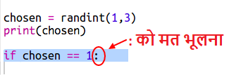
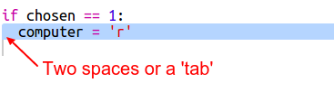

## कंप्यूटर की बारी

अब कंप्यूटर की बारी है। आप `randint` फ़ंक्शन का उपयोग कर सकते हैं एक यादृच्छिक संख्या(random number) उत्पन्न करने के लिए, जिसके जरिए रॉक, पेपर और कैंची के बीच तय किया जा सके।

+ `randint` का उपयोग कर के यादृच्छिक संख्या उत्पन्न करे और देखें की कंप्युटर ने रॉक, पेपर और कैंची में से क्या चुना है।
    
    

+ अपनी स्क्रिप्ट को बहुत बार चलाएं (आपको हर बार 'r', 'p' या 's' दर्ज करना होगा।)
    
    आपको यह देखना चाहिए कि कंप्युटर का चयन बेतरतीब ढंग से 1, 2 या 3 पर सेट है।

+ मान लीजिए:
    
    + 1 = रॉक (r)
    + 2 = कागज (p)
    + 3 = सिज़र /कैंची (s)
    
    `If` का इस्तेमाल कर के देखें की चुना गया अंक `1` है। (`==` का इस्तेमाल यह जाँचने के लिए किया जाता है की दो चीजें समान हैं अथवा नहीं)।
    
    

+ Python **indentation** (दाईं ओर कोड ले जाना) का उपयोग करता है यह दिखाने के लिए कि कौन सा कोड `if` के अंदर है । आप या तो दो स्पेस का उपयोग कर सकते हैं (स्पेसबार को दो बार टैप करें) या **tab** बटन को टैप करें (आमतौर पर कीबोर्ड पर CAPSLOCK से ऊपर होता है)।
    
    `computer` को 'r' पे सेट करें, `if` के अंदर इन्डेन्टैशन का उपयोग कर के।
    
    

+ आप `elif` का उपयोग करके एक वैकल्पिक चेक जोड़ सकते हैं। यह (*else if* ) का संक्षिप्त है:
    
    
    
    यह स्थिति केवल तभी चेक की जाएगी जब पहली शर्त(कन्डिशन) विफल हो जाती है (यदि कंप्यूटर ने `1` नहीं चुना)

+ और अंत में, अगर कंप्यूटर ने `1` या `2` नहीं चुना, फिर इसने ` 3` चुना होगा।
    
    इस बार हम बस `else` का उपयोग कर सकते हैं जिसका अर्थ है अन्यथा।
    
    

+ अब, यादृच्छिक संख्या(random number) को प्रिंट करने के बजाय जिसे कंप्यूटर ने चुना है, आप लेटर को प्रिंट कर सकते हैं।
    
    
    
    आप या तो लाइन `print(chosen)` को हटा सकते हैं, या लाइन की शुरुआत में ` # ` लिख कर कंप्युटर को इसे अनदेखा करने को कह सकते हैं.

+ रन पर क्लिक करके और अपना विकल्प चुनकर अपने कोड का परीक्षण करें।

+ आप देखेंगे कि, कंप्यूटर की पसंद एक नई लाइन पर प्रिन्ट हो रही है। आप `vs` के बाद `end=' '` 'जोड़कर उसे ठीक कर सकते हैं, जो python को एक नई पंक्ति के बजाय एक स्थान/स्पेस के साथ समाप्त होने के लिए कहता है।
    
    

+ रन पर क्लिक करके और एक विकल्प चुन कर खेल को कुछ बार खेलें।
    
    अभी के लिए आपको खुद पता लगाना होगा की जीत किसकी हुई। इसके बाद आप python code के जरिए इसका पता लगाएंगे।