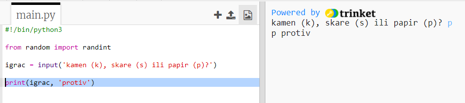

## Igrač je prvi na redu

Za početak, neka igrač odabere kamen, škare ili papir.

+ Otvori ovaj trinket: <a href="http://jumpto.cc/rps-go" target="_blank">jumpto.cc/rps-go</a>.

+ Projekt već sadrži kôd za uvoz funkcije koju ćeš koristiti u ovom projektu.
    
    
    
    Kasnije ćeš koristiti funkciju `randint` za generiranje nasumičnih brojeva.

+ Prvo neka igrač upiše slovo 'k', 's' ili 'p' kako bi odabrao kamen, škare ili papir.
    
    

+ Sada ispiši ono što je igrač odabrao:
    
    

+ Testiraj svoj kôd klikom na `Run`. Klikni na prozor trinketa i unesi svoj odabir.