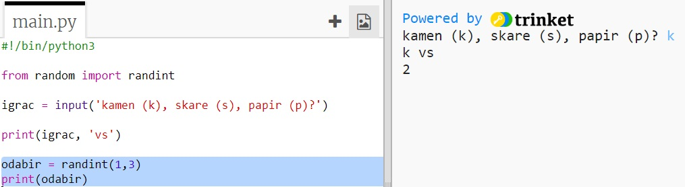
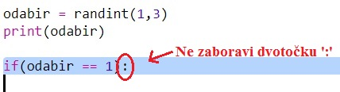
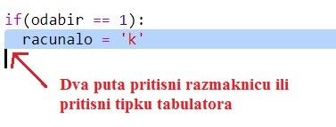
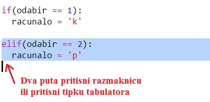
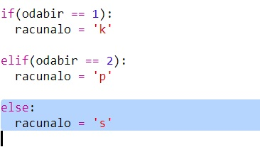
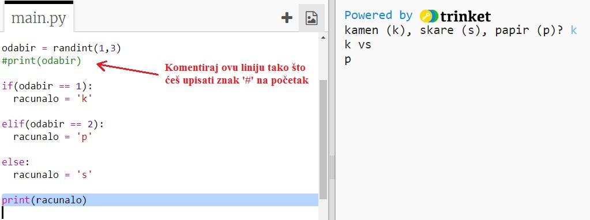
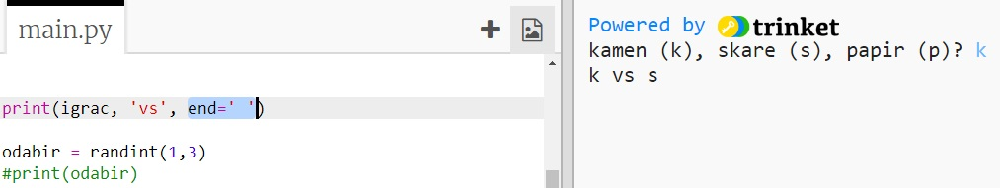

## Računalo je na redu

Sada je red na računalu. Možeš koristiti funkciju `randint` kako bi generirao nasumični broj koji će odlučiti hoće li računalo odabrati kamen, škare ili papir.

+ Koristi funkciju `randint` kako bi generirao nasumični broj koji će odlučiti hoće li računalo odabrati kamen, škare ili papir.
    
    

+ Pokreni program nekoliko puta (svaki put ćeš morati unijeti 'k', 's' ili 'p'.)
    
    Vidjet ćeš da je varijabla 'odabir' nasumično podešena na 1, 2 ili 3.

+ Neka je:
    
    + 1 = kamen (k)
    + 2 = papir (p)
    + 3 = škare (s)
    
    Koristi naredbu `if` za provjeru je li odabran broj `1` (`==` se koristi kada želimo provjeriti jesu li dvije stvari jednake).
    
    

+ Python koristi **uvlačenje** (pomicanje kôda udesno) kako bi označio koji dio kôda se nalazi unutar naredbe `if`. Za uvlačenje možeš koristiti dva razmaka (dva puta pritisni razmaknicu) ili pritisnuti **tipku tabulatora** (obično se nalazi iznad tipke CAPSLOCK za velika slova.)
    
    Varijabli `racunalo` pridruži vrijednost 'k' i postavi ju unutar naredbe `if` koristeći uvlačenje:
    
    

+ Možeš napraviti dodatnu provjeru koristeći naredbu `elif` (skraćeno od *else if*):
    
    
    
    Ovaj uvjet će se provjeravati samo ako prvi uvjet ne bude istinit (ako računalo nije odabralo `1`)

+ Konačno, ako računalo nije odabralo ni `1` ni `2`, onda je zasigurno odabralo `3`.
    
    U ovom slučaju možemo jednostavno koristiti naredbu `else` koja znači 'onda'.
    
    

+ Umjesto ispisivanja nasumičnog broja kojeg je računalo odabralo, možeš ispisati slovo koje ono označava.
    
    
    
    Izbriši liniju kôda `print(odabir)` ili na početak linije dodaj znak ljestvi `#`. Tako će računalo zanemariti tu liniju.

+ Testiraj svoj kôd klikom na Run i unesi svoj odabir.

+ Hmm, odabir računala ispisuje se u novom redu. Možeš to promijeniti dodavanjem naredbe `end=' '` nakon `vs`. Tako će Python znati da mora završiti sa razmakom, a ne novim redom.
    
    

+ Odigraj igru nekoliko puta klikom na Run i unošenjem svog odabira.
    
    Za sada ćeš morati sam odrediti tko je pobjednik. No uskoro ćeš dodati Python kôd koji će to raditi umjesto tebe.