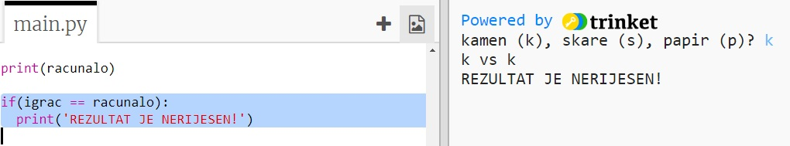
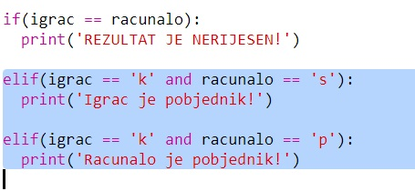
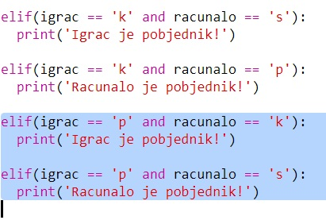
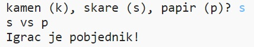

## Provjeri rezultat

Dodajmo sada kôd kojim ćemo saznati tko je pobjednik.

+ Da bi saznao tko je pobjedio moraš usporediti varijable `igrac` i `racunalo`.
    
    Ako su varijable jednake, onda je rezultat neriješen:
    
    

+ Isprobaj program igrajući igru nekoliko puta dok ne dobiješ neriješen rezultat.
    
    Klikni na `Run` kako bi započeo novu igru.

+ Pogledajmo sada sve slučajeve kada je igrač odabrao 'k' (kamen), a računalo nije.
    
    Ako je računalo odabralo 's' (škare), onda je igrač pobjednik (kamen pobjeđuje škare).
    
    Ako je računalo odabralo 'p' (papir), onda je računalo pobjednik (papir pobjeđuje kamen).
    
    Možemo provjeriti što su odabrali igrač *i* računalo koristeći `and`.
    
    

+ Pogledajmo sada slučajeve kada je igrač odabrao 'p' (papir), a računalo nije:
    
    

+ Konačno, možeš li dodati kôd kojim ćeš provjeriti tko je pobjednik ako je igrač odabrao 's' (škare), a računalo kamen ili papir?

+ Pokreni igru i isprobaj kôd.
    
    
    
    Klikni na `Run` da započneš novu igru.