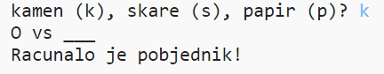
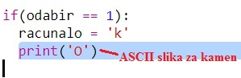
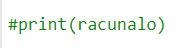
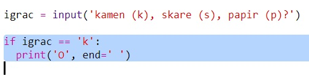

\--- challenge \---

## Izazov: ASCII umjetnost

Možeš li, umjesto slova k, s i p koja predstavljaju kamen, škare i papir, koristiti ASCII umjetnost?

Na primjer:

Gdje je:

    kamen: O
    papir: ___
    škare: >8
    

+ Umjesto naredbe `print(racunalo)` moraš dodati novu liniju kôda unutar naredbe `if` za svaku opciju kako bi se ispisao odgovarajući ASCII simbol. 

Pomoć:

+ Umjesto naredbe `print(igrac)` moraš dodati novu if naredbu koja će provjeravati što je igrač odabrao i na temelju toga ispisati odgovarajući ASCII simbol:

Hint:

Ne zaboravi da dodavanjem `end=' '` na kraju `print` naredbe, naredba završava razmakom, a ne novim redom.

\--- /challenge \---