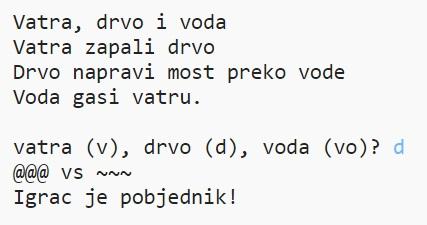

--- challenge ---

## Izazov: Napravi novu igru

Možeš li napraviti vlastitu igru sličnu igri Kamen, škare i papir, ali s drugačijim objektima?

Klikni na gumb 'Duplicate' kako bi napravio kopiju svog Kamen, škare i papir projekta.

U ovom primjeru koriste se vatra, drvo i voda:

--- /challenge ---

***
Ovaj su projekt preveli volonteri:

**Maja Manojlović**

**Ivana Vezjak**

Zahvaljujući volonterima, možemo pružiti ljudima širom svijeta priliku da uče na svom jeziku. Možete nam pomoći da dođemo do većeg broja ljudi tako da postanete volonter prevoditelj. Više informacija možete pronaći na [rpf.io/translate](https://rpf.io/translate).