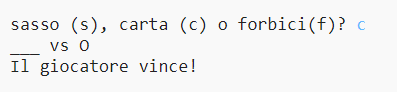

## Introduzione

In questo progetto realizzerai il gioco Sasso, Carta, Forbici, e giocherai contro il computer.

Regole: sia tu che il computer dovete scegliete sasso, carta o forbici. Il vincitore è deciso da queste regole:

* Sasso schiaccia forbici
* Carta copre sasso
* Forbici tagliano carta

  <iframe src="https://trinket.io/embed/python/e1e1d873be?outputOnly=true&start=result" width="600" height="500" frameborder="0" marginwidth="0" marginheight="0" allowfullscreen>
  </iframe>
  

### Ulteriori informazioni per gli organizzatori dei club

Se intendete stampare questo progetto, cliccate su [Versione stampabile](https://projects.raspberrypi.org/en/projects/rock-paper-scissors/print).

## \--- collapse \---

## title: Note per i volontari

## Introduzione:

In questo progetto, i bambini impareranno come creare un programma per giocare a Sasso, Carta, Forbici usando variabili e istruzioni condizionali.

## Risorse online

** Questo progetto utilizza Python 3. ** Consigliamo di utilizzare [trinket](https://trinket.io/) per lavorare con Python online. Questo progetto contiene i seguenti Trinket:

* [‘Rock, Paper, Scissors’ Resources -- jumpto.cc/rps-go](http://jumpto.cc/rps-go)

C'è anche un trinket che contiene il progetto completo:

* [‘Rock, Paper, Scissors’ Finished -- trinket.io/python/e1e1d873be](https://trinket.io/python/e1e1d873be)

## Risorse offline

Questo progetto può essere [completato offline](https://www.codeclubprojects.org/en-GB/resources/python-working-offline/), se si preferisce. È possibile accedere alle risorse del progetto facendo click sul link "Materiali del progetto" relativo a questo progetto. Questo link contiene una sezione "Risorse del progetto", che include le risorse necessarie ai bambini per completare il progetto offline. Assicuratevi che ogni bambino abbia accesso a una copia di queste risorse. Questa sezione include i seguenti file:

* rock-paper-scissors/rock-paper-scissors.py

Potete anche trovare una versione completa di questo progetto nella sezione 'Risorse per i volontari', che contiene:

* rock-paper-scissors-finished/rock-paper-scissors.py

(Tutte le risorse sopracitate sono anche scaricabili come file progetto e volontario `.zip `.)

## Obiettivi di apprendimento

* Variabili;
* Selezione (`if`, `elif`, `else`); 
* Booleani `==` e `and`.

Questo progetto include elementi tratti dalle seguenti componenti del [Digital Making Curriculum di Raspberry Pi](http://rpf.io/curriculum):

* [Utilizzare i costrutti base di un linguaggio di programmazione per creare programmi semplici.](https://www.raspberrypi.org/curriculum/programming/creator)

## Sfide

* "Disegni ASCII" - Utilizza la logica condizionale per creare disegni in ASCII per il sasso, la carta e le forbici. 
* "Crea un nuovo gioco" - Duplica il gioco Sasso, Carta, Forbici e remixalo per creare un nuovo gioco. 

\--- /collapse \---

## \--- collapse \---

## title: Materiali del progetto

## Risorse del progetto

* [File .zip contenente tutte le risorse del progetto](resources/rock-paper-scissors-project-resources.zip)
* [Trinket online contenente tutte le risorse del progetto 'Sasso, Carta, Forbici'](http://jumpto.cc/rps-go)
* [rock-paper-scissors/rock-paper-scissors.py](resources/rock-paper-scissors-rock-paper-scissors.py)

## Risorse per gli organizzatori del club

* [File .zip contenente tutte le risorse del progetto](resources/rock-paper-scissors-volunteer-resources.zip)
* [Progetto Trinket completato online](https://trinket.io/python/e1e1d873be)
* [rock-paper-scissors-finished/rock-paper-scissors.py](resources/rock-paper-scissors-finished-rock-paper-scissors.py)

\--- /collapse \---