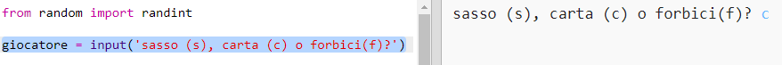
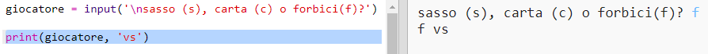

## Turno del Giocatore

Per prima cosa, lascia che il giocatore scelga Sasso, Carta o Forbici.

+ Apri questo trinket: <a href="http://jumpto.cc/rps-go" target="_blank">jumpto.cc/rps-go</a>.

+ Il progetto contiene già il codice per importare una funzione che utilizzerai in questo progetto.
    
    
    
    Userai `randint` più avanti per generare numeri a caso.

+ Per prima cosa, lascia che il giocatore scelga Sasso, Carta o Forbici digitando la lettera 's', 'c' o 'f'.
    
    

+ Ora printa (fai mostrare) cosa il giocare ha scelto:
    
    

+ Prova il tuo codice facendo click su `Run`. Fai click nella finestra di output del trinket e inserisci la tua scelta.