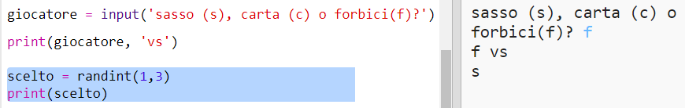
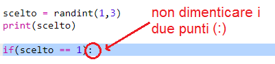
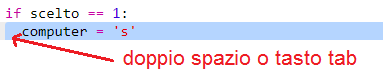
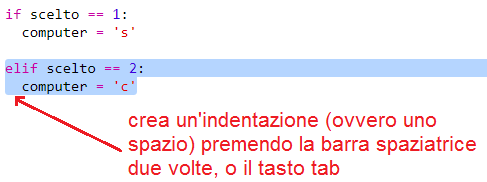
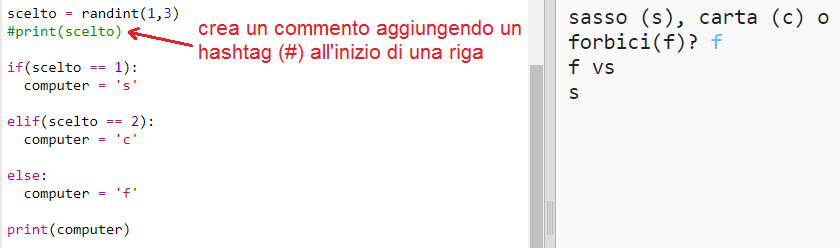
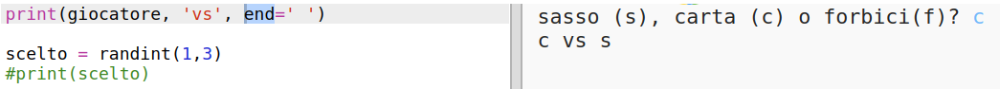

## Turno del Computer

Ora tocca al computer. Puoi usare la funzione `randint` per generare un numero a caso che decida fra sasso, carta o forbici.

+ Usa `randint` per generare un numero a caso per decidere se il computer ha scelto sasso, carta o forbici.
    
    

+ Esegui il tuo codice tante volte (avrai bisogno di inserire 's', 'c' o 'f' ogni volta.)
    
    Dovresti vedere che 'scelto' è impostato casualmente su 1, 2 o 3.

+ Facciamo che:
    
    + 1 = sasso (s)
    + 2 = carta (c)
    + 3 = forbici (f)
    
    Usa `if` per controllare se il numero scelto è `1` (si usa `==` per vedere se 2 cose sono uguali).
    
    

+ Python usa l'**indentazione** (spostare il codice a destra) per mostrare quale parte del codice è dentro l'`if`. Puoi usare due spazi (premi la barra spaziatrice due volte) oppure premi il tasto **tab** (si trova solitamente sopra il tasto CAPSLOCK sulla tastiera.)
    
    Imposta il `computer` su 's' nell'`if` usando l'indentazione:
    
    

+ Puoi aggiungere un controllo ulteriore usando `elif` (abbreviazione per *else if*):
    
    
    
    Questa condizione sarà controllata solo se la prima fallisce (se il computer non ha scelto `1`)

+ Infine, se il computer non ha scelto `1` o `2`, deve aver quindi scelto `3`.
    
    Questa volta possiamo semplicemente usare `else` che significa altrimenti.
    
    

+ Ora, invece printare (far mostrare) il numero casuale che il computer ha scelto, puoi far printare la lettera corrispondente.
    
    
    
    Puoi cancellare la riga `print(scelto)`, o farla ignorare al computer aggiungendo un `#` all'inizio della riga.

+ Testa il tuo codice cliccando su Esegui e scegliendo la tua opzione.

+ Mmh, la scelta del computer viene printata su una nuova riga. Puoi aggiustarlo aggiungendo `end=' '` dopo `vs`, ciò dice a Python di finire con uno spazio invece che una nuova riga.
    
    

+ Gioca alcune volte al gioco facendo click su Esegui e facendo la tua scelta.
    
    Per ora dovrai capire chi ha vinto da solo. Successivamente aggiungerai il codice Python per risolvere questo problema.