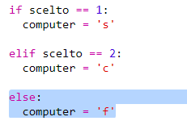

## Turno del Computer

Adeso è il turno del computer. Puoi usare la funzione 'randint' per generare un numero a caso e decidere tra sasso, carta e forbici.

+ Usa 'randint' per generare un numero a caso per decidere se il computer ha scelto sasso, carta o forbici.

  

+ Esegui tante volte il tuo script (dovrai inserire ogni volta 'r', 'p' o 's'.)

  Dovresti vedere che 'chosen' è regolato a caso a 1, 2 o 3.

+ Diciamo:

  + 1 = sasso (r)
  + 2 = carta (p)
  + 3 = forbici (s)

  Usa 'if' per controllare se il numero scelto è '1' (`==` è usato per vedere se 2 cose sono le stesse).

  

+ Python usa_l'indentatura_ (muovere il codice verso destra) per mostrare quale codice si trova dentro 'if'. Puoi usare due spazi (batti due volte la barra spaziatrice) o premi il_tasto tab_ (di solito nella tastiera si trova sopra il Blocco Maiuscole.)

  Imposta il computer a 'r' dentro il 'if' usando l'indentatura:

  

+ Puoi aggiungere un controllo alternativo usando 'elif' (abbreviazione di _else if_):

  

  Questa condizione verrà controllata solo se la prima condizione fallisce (se il computer non sceglie '1')

+ E per finire, se il computer non sceglie '1' o '2' allora deve avere scelto '3'.

  Questa volta, possiamo semplicemente usare 'else' che significa altrimenti.

  

+ Ora, invece di stampare il numero a caso che il computer ha scelto, puoi stampare la lettera.

   

   Puoi cancellare la linea 'print(chosen)' o fare in modo che il computer la ignori aggiungendo un `#` all'inizio della linea.

+ Prova il tuo codice cliccando Run e scegliendo la tua opzione.

+ Attenzione, la scelta del computer si stampa in una nuova linea. Puoi risolverlo aggiungendo `end=' '` dopo `vs`, indicando a Python di finire con uno spazio invece di una nuova linea.

   

+ Gioca qualche partita cliccando Run e facendo una scelta.

  Per adesso, dovrai essere tu a capire chi ha vinto. In seguito, aggiungerai il codice Pythin per verificarlo.   
