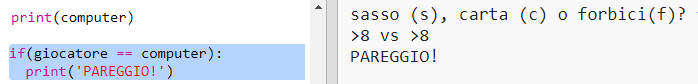
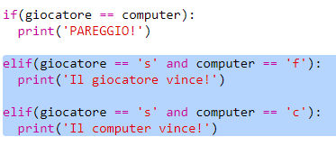
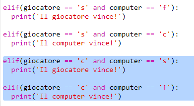
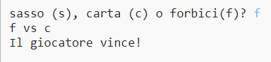

## Controlla il Risultato

Ora aggiungiamo il codice per vedere chi ha vinto.

+ Devi confrontare le variabili `giocatore` e `computer` per vedere chi ha vinto.
    
    Se sono uguali, allora è un pareggio:
    
    

+ Testa il tuo codice giocando alcune volte al gioco fino a che non ottieni un pareggio.
    
    Dovrai cliccare `Esegui` per iniziare una nuova partita.

+ Ora diamo un'occhiata al caso in cui il giocatore sceglie 's' (sasso) ma il computer no.
    
    Se il computer sceglie 'f' (forbici) allora il giocatore vince (sasso batte forbici).
    
    Se il computer sceglie 'c' (carta) allora il computer vince (carta batte sasso).
    
    Possiamo controllare la scelta del giocatore *e* del computer usando `and`.
    
    

+ Adesso, diamo un'occhiata al caso in cui il giocatore sceglie 'c' (carta) ma il computer no:
    
    

+ Infine, sapresti aggiungere il codice per controllare il vincitore quando il giocatore sceglie 'f' (forbici) e il computer sceglie sasso o carta?

+ Ora gioca per testare il tuo codice.
    
    
    
    Clicca `Esegui` per iniziare una nuova partita.