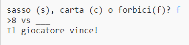
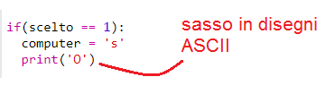
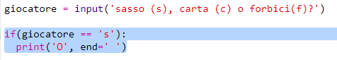

\--- challenge \---

## Sfida: Disegni ASCII

Invece di usare le lettere s, c e f per rappresentare sasso, carta e forbici, puoi usare i disegni ASCII?

Per esempio:

Dove:

    sasso: O
    carta: ___
    forbici: >8
    

+ Invece di `print (computer)` dovrai aggiungere una nuova riga in ogni opzione nell'`if` per stampare i disegni ASCII corretti. 

Suggerimenti:

+ Invece di dire `print giocatore` dovrai aggiungere una nuova condizione per controllare quale opzione il giocatore ha scelto e printare i disegni ASCII corretti:

Suggerimento:

Ricorda che aggiungere `end=' '` alla fine di un `print` lo fa finire con uno spazio invece che con una nuova riga.

\--- /challenge \---