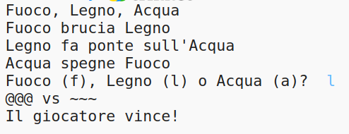

\--- challenge \---

## Sfida: Crea un nuovo gioco

Sapresti creare il tuo gioco di Sasso, Carta, Forbici con oggetti diversi?

Clicca il pulsante 'Duplicate' per creare una copia del tuo progetto Sasso, Carta, Forbici da cui iniziare.

Questo esempio usa Fuoco, Legno e Acqua:

\--- /challenge \---