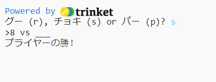

## はじめに

このプロジェクトでは、じゃんけんゲームを作って、コンピューターと勝負します。

ゲームの決まり: みなさんとコンピューターが、それぞれグー、チョキ、パーのどれかを選びます。 勝ち負けは、次のルールで決まります:

* グー(石ころ)は、チョキ(はさみ)では切れない
* チョキ(はさみ)は、パー(紙)を切ってしまう
* パー(紙)は、グー(石ころ)を包み込んでしまう

  <iframe src="https://trinket.io/embed/python/e1e1d873be?outputOnly=true&start=result" width="600" height="500" frameborder="0" marginwidth="0" marginheight="0" allowfullscreen>
  </iframe>
  

### クラブリーダーへの追加情報

もしこのプロジェクトを印刷する場合、[印刷用バージョン](https://projects.raspberrypi.org/en/projects/rock-paper-scissors/print)を使ってください。

## \--- collapse \---

## title：指導者用ノート

## はじめに

本プロジェクトでは、変数と条件式を使って、じゃんけんゲームの作り方を学びます。

## オンライン・リソース

**本プロジェクトでは、Python 3**を使います。オンラインでPythonのコードを記述するには、[trinket](https://trinket.io/)の使用をお勧めします。 本プロジェクトには、以下のtrinketが用意されています：

* [‘グー、チョキ、パー’ リソース -- jumpto.cc/rps-go](http://jumpto.cc/rps-go)

また、完成版プログラムが入力済みのtrinketも用意されています

* [‘グー、チョキ、パー’ 完成版プログラム -- trinket.io/python/e1e1d873be](https://trinket.io/python/e1e1d873be)

## オフライン・リソース

本プロジェクトは、[オフライン](https://www.codeclubprojects.org/en-GB/resources/python-working-offline/)環境で実施することも可能です。 必要なリソースを入手するには、「プロジェクト資料のダウンロード」をクリックしてください。 リンク先ページの「プロジェクト・リソース」セクションからダウンロードできますので 、必ず子供達各自が必要資料を全て持っているようにしてください。 本セクションには、以下のファイルが含まれます：

* rock-paper-scissors / rock-paper-scissors.py

また、以下の完成版プログラムは、「リーダー用ノート」セクションから入手可能です。

* rock-paper-scissors-finished/rock-paper-scissors.py

(上述の全リソースは、project and volunteer`.zip`ファイル形式でダウンロード可能です。)

## 学習のねらい

* 変数
* 条件選択 (`if`, `elif`, `else`); 
* 論理演算式 `==`および`and`.

本プロジェクトは、[Raspberry Pi Digital Making Curriculum](http://rpf.io/curriculum)に含まれる下記項目をカバーしています。

* [基本的なプログラミング構文を使って、簡単なプログラムを作る](https://www.raspberrypi.org/curriculum/programming/creator)

## チャレンジ

* 「アスキーアート」 - 条件式を使って、グー、チョキ、パーそれぞれのアスキーアートを表示させる。 
* 「新しいゲームを作る」 -じゃんけんゲームを複製し、それに手を加えて新しいゲームを創作する。 

\--- /collapse \---

## \--- collapse \---

## title: プロジェクト資料

## プロジェクト資料

* [全プロジェクト・リソースの入った.zipファイル](resources/rock-paper-scissors-project-resources.zip)
* [「じゃんけん」プロジェクト・リソースの入ったのオンラインtrinket](http://jumpto.cc/rps-go)
* [rock-paper-scissors / rock-paper-scissors.py](resources/rock-paper-scissors-rock-paper-scissors.py)

## クラブ・リーダー向けリソース

* [全プロジェクトの完成版リソースの入った.zipファイル](resources/rock-paper-scissors-volunteer-resources.zip)
* [完成版プロジェクトのオンラインtrinket](https://trinket.io/python/e1e1d873be)
* [rock-paper-scissors-finished/rock-paper-scissors.py](resources/rock-paper-scissors-finished-rock-paper-scissors.py)

\--- /collapse \---