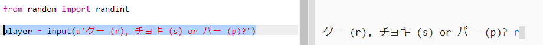
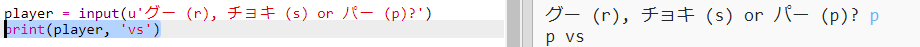

## プレーヤーの番

最初に、プレーヤーにグー、チョキ、パーのどれかを選んでもらいます。

+ Trinketをひらく: <a href="http://jumpto.cc/rps-go" target="_blank">jumpto.cc/rps-go</a>.

+ このプロジェクトで使う関数を呼び出すためのコードは、既に入力されています。
    
    
    
    ランダムな数字を作り出すために`randint`という関数を後で使います。

+ まず初めに、プレーヤーにグー(rock)、チョキ(scissors)、パー(paper)のどれかを選んでもらいましょう。そのためには、’r’、’s’、’p’ のどれかの文字を入力してもらいます。
    
    

+ プレーヤーが入力した文字を表示させましょう:
    
    

+ `Run`をクリックして、あなたが書いたコードをテストしましょう。 Trinketのアウトプット・ウィンドウの中をクリックしてから、どれか文字を選んで入力してみましょう。