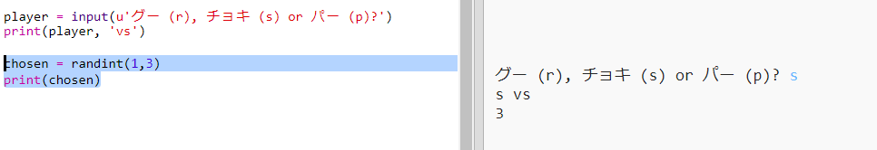
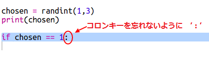
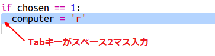
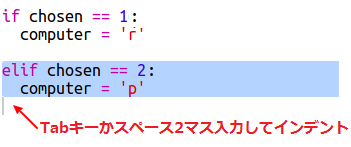
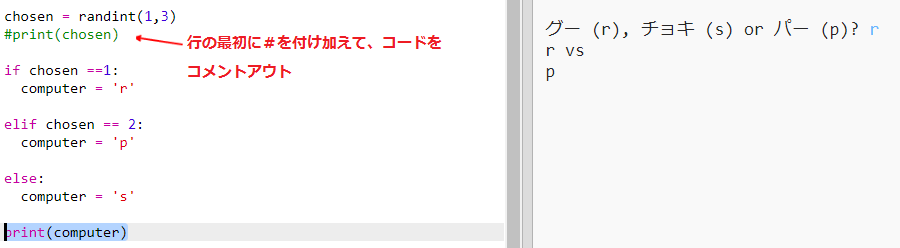
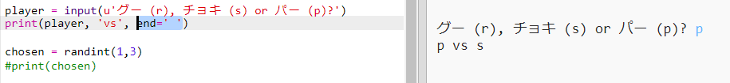

## コンピューターの番

次は、コンピューターの番です。 グー、チョキ、パーのどれにするかをランダムに決める数字を作り出すために、 `randint` 関数を使います。

+ コンピューターがグー(rock)、チョキ(scissors)、パー(paper) のどれを選んだかを決めるために、ランダムな数字を作り出す`randint`を使いましょう。
    
    

+ 作成したスクリプトを何回も実行してテストしてみましょう。(毎回 ‘r’、’s’、’p’のどれかを入力してください。)
    
    ‘chosen’に、1か2か3の数字がランダムで当てはめられていることがわかります。

+ ここでは:
    
    + 1 = rock (r) 「グー 」
    + 2 = paper (p)「パー 」
    + 3 = scissors (s) 「チョキ 」
    
    だとします。`if` を使って、コンピューターが選んだ数字が`1`だったかどうかを確かめましょう。(`==`を使って、2つのものが同じものかどうかをチェックできます。)
    
    

+ Pythonでは、 **インデント(コードを右側にずらすこと)** を使って、どのコードが`if`の内容なのかわかりやすくなるように表示します。 スペース2マスを入力する(スペースキーを2回押す)か、**tabキー**(通常はCAPS LOCKキーの上にある)を押しましょう。
    
    インデントしたら、`if` の内容として、`computer` に ’r’ を当てはめましょう:
    
    

+ `elif`(*else if*)の略)を使って、別の場合の条件を追加します。
    
    
    
    この2番目の条件は、最初の条件が当てはまらなかった場合(つまり、もしコンピューターが`1`を選ばなかった場合)にだけチェックされます。

+ そして最後に、もしコンピューターが`1` も`2`も選ばなかった場合は、`3`を選んだのだということがわかります。
    
    これに対しては、「もしそれ以外の場合は」という意味の`else` を使いましょう。
    
    

+ ここまでくると、コンピューターが選んだランダムな数字の代わりに、文字を表示させることができるようになりました。
    
    
    
    `print(chosen)`と入力した行は、削除してしまってもよいですし、その行の最初に `#` を付け加えることで、コンピューターがその行を無視するようにしてしまってもよいです。

+ Runをクリックしてから’r’, ’s’, ’p’のどれかを選んで、コードがきちんと動くかテストしましょう。

+ うーん、コンピューターが選んだ文字が、別の行に表示されてしまいました。 これを直すには、`vs`の後ろに、`end=' '` を追加しましょう。こうすると、行の最後はスペースで終わるようになって、別の行にはならなくなります。
    
    

+ Runをクリックしてから文字を選んで、何回かゲームをやってみましょう。
    
    今のところ、みなさんとコンピューターのどちらがじゃんけんに勝ったかは、みなさんが判定しないといけません。 次のステップでは、さらにPythonコードをつけ足して、自動的に勝ち負けを判定できるようにします。