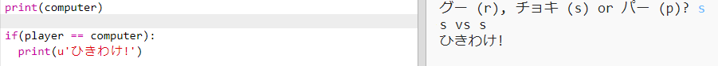
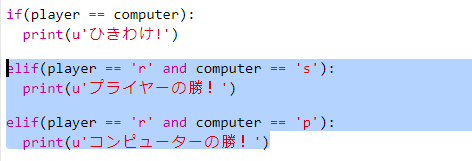
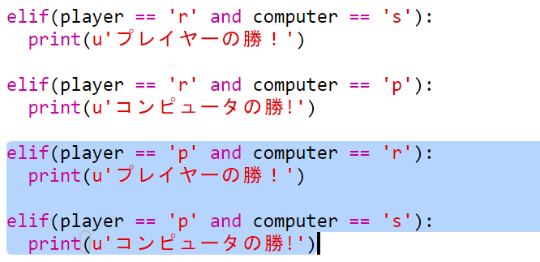
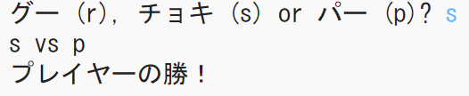

## 勝ち負けの判定

では、どちらが勝ったかを判定するためのコードを追加しましょう。

+ `player` と`computer` の2つを比べて、どちらが勝ったかを判定します。
    
    もし同じだったら、「あいこ」になります。
    
    

+ 「あいこ」が出るまで何回かゲームをやってみて、コードが正しく動いているか試してみましょう。
    
    ゲームを始めるには、`Run`をクリックします。

+ では、プレーヤーが ’r’ (グー)を選んで、コンピューターがそれ以外を選んだ場合を考えてみましょう。
    
    もしコンピューターが ‘s’ (チョキ)を選んだなら、プレーヤーの勝ちです。(グーはチョキに勝ちます。)
    
    もしコンピューターが ‘p’ (パー)を選んだなら、コンピューターの勝ちです。(パーはグーに勝ちます。)
    
    プレーヤー*と*コンピューターが選んだものをチェックするには、`and`を使います。
    
    

+ 次に、プレーヤーが ‘p’ (パー)を選んで、コンピューターがそれ以外を選んだ場合を考えてみましょう。
    
    

+ そして最後に、プレーヤーが ‘s’ (チョキ)を選んで、コンピューターがグーあるいはパーを選んだ場合の勝ち負けを判定するコードを追加してみましょう。

+ ゲームをプレイして、完成したコードをテストしましょう。
    
    
    
    ゲームを始めるには、`Run`をクリックします。