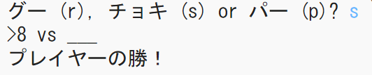
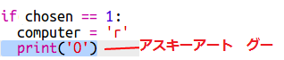
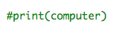

--- challenge ---

## チャレンジ: ASCII(アスキー) アート

グー(rock)、チョキ(scissors)、パー(paper) を表すのに r、s、pの文字ではなく、アスキーアートを使うことはできますか？

例えば:

は: 

    グー: O
    チョキ: >8
    パー: ___
    

+ グー(rock)、チョキ(scissors)、パー(paper)のそれぞれに正しいアスキーアートを表示するには、`print computer` を使うのではなく、`if` の中でそれぞれの場合に対応して新しい行を挿入してコードを追加しなくてはなりません。 

ヒント:

+ `print player`は使わずに、新しくifを加えてプレーヤーがどれを選んだかをチェックするようにして、正しいアスキーアートが表示されるようにします。

ヒント:

`print` の最後に `end=' '` を追加すると、その文が実行されたときに、別の行にはならずにスペースで終わるようになることを覚えておきましょう。

--- /challenge ---