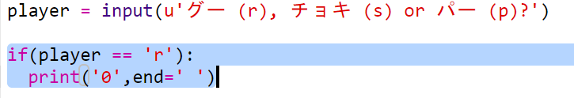

\--- challenge \---

## チャレンジ: ASCII(アスキー) アート

グー(rock)、チョキ(scissors)、パー(paper) を表すのに r、s、pの文字ではなく、アスキーアートを使うことはできますか？

例えば:

は: 

    グー: O
    チョキ: >8
    パー: ___
    

+ Instead of saying `print (computer)` you'll need to add a new line to each of the options in the `if` to print out the correct ASCII art. 

ヒント:

+ Instead of saying `print (player)` you'll need to add a new if statement to check which item the player chose and print out the correct ASCII art:

ヒント:

`print` の最後に `end=' '` を追加すると、その文が実行されたときに、別の行にはならずにスペースで終わるようになることを覚えておきましょう。

+ Include a line to print `vs` between the player and computer results.

    print('vs', end=' ')
    

\--- /challenge \---