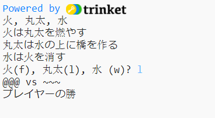

\--- challenge \---

## チャレンジ: 新しいゲームを作る

グー、チョキ、パーの代わりに何か別の物を使って、同じようなゲームを作れますか？

‘Duplicate’ (Remix)をクリックすると、今作ったじゃんけんゲームのコピーができますので、そこをもとにして始めてみましょう。

この例では、火(fire)、丸太(logs)、水(water)を使います:

\--- /challenge \---