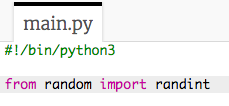

## ಆಟಗಾರನ ಸರದಿ

ಮೊದಲಿಗೆ, ಆಟಗಾರನು ಬಂಡೆ(rock), ಕಾಗದ(paper) ಅಥವಾ ಕತ್ತರಿ(scissors) ಆಯ್ಕೆ ಮಾಡಲಿ.

+ ಈ trinket ತೆಗೆಯಿರಿ: <a href="http://jumpto.cc/rps-go" target="_blank"> jumpto.cc/rps-go </a>.

+ ಈ ಯೋಜನೆಯಲ್ಲಿ ನೀವು ಬಳಸಲು ಹೊರಟಿರುವ ಕಾರ್ಯವನ್ನು(function) ಆಮದು ಮಾಡಲು ಕೋಡ್ ಈಗಾಗಲೇ ಯೋಜನೆಯಲ್ಲಿ ಒಳಗೊಂಡಿದೆ.
    
    
    
    ನೀವು `randint` ಅನ್ನು ನಂತರ ಯಾದೃಚ್(ಮನಬಂದಂತಹ) ಸಂಖ್ಯೆಗಳನ್ನು ರಚಿಸಲು ಬಳಸುತ್ತೀರಿ.

+ ಮೊದಲಿಗೆ, ಆಟಗಾರನು 'r', 'p' ಅಥವಾ 's' ಅಕ್ಷರವನ್ನು ಟೈಪ್ ಮಾಡುವ ಮೂಲಕ ಬಂಡೆ(Rock), ಕಾಗದ(Paper) ಅಥವಾ ಕತ್ತರಿ(Scissor) ಆಯ್ಕೆ ಮಾಡಲಿ.
    
    

+ ಈಗ ಆಟಗಾರನು ಆರಿಸಿದ್ದನ್ನು ಮುದ್ರಿಸಿ:
    
    

+ ` Run ` (ರನ್) ಕ್ಲಿಕ್ ಮಾಡುವ ಮೂಲಕ ನಿಮ್ಮ ಕೋಡ್ ಅನ್ನು ಪರೀಕ್ಷಿಸಿ. ಟ್ರಿಂಕೆಟ್ ಔಟ್ಪುಟ್ ವಿಂಡೋದಲ್ಲಿ(trinket output window) ಕ್ಲಿಕ್ ಮಾಡಿ ಮತ್ತು ನಿಮ್ಮ ಆಯ್ಕೆಯನ್ನು ನಮೂದಿಸಿ.