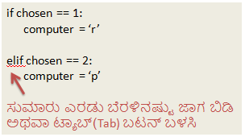

## ಕಂಪ್ಯೂಟರ್ ನ ಸರದಿ

ಈಗ ಅದು ಕಂಪ್ಯೂಟರ್‌ನ ಸರದಿ. ನೀವು `randint` ಫುನ್ಕ್ಷನ್ಅನ್ನು(function) ಬಳಸವ ಮೂಲಕ ಯಾದೃಚ್(ಮನಬಂದಂತಹ) ಸಂಖ್ಯೆಯನ್ನು ಉತ್ಪಾದಿಸಿ, ಬಂಡೆ(Rock), ಕಾಗದ(Paper) ಮತ್ತು ಕತ್ತರಿಗಳ(Scissor) ನಡುವೆ ನಿರ್ಧರಿಸಬಹುದು.

+ ` randint ` ಬಳಸಿ ಯಾದೃಚ್(ಮನಬಂದಂತಹ) ಸಂಖ್ಯೆಯನ್ನು ಉತ್ಪಾದಿಸಿ, ಇದರಿಂದ ಕಂಪ್ಯೂಟರ್ ಬಂಡೆ(Rock), ಕಾಗದ(Paper) ಅಥವಾ ಕತ್ತರಿಗಳ(Scissor) ನಡುವೆ ಯಾವುದು ಆರಿಸಿದೆ ಎಂದು ನಿರ್ಧರಿಸಬಹುದು.
    
    

+ ನಿಮ್ಮ ಸ್ಕ್ರಿಪ್ಟ್ ಅನ್ನು ಸಾಕಷ್ಟು ಬಾರಿ ಚಲಾಯಿಸಿ(ರನ್ ಮಾಡಿ) \[Run\](ನೀವು ಪ್ರತಿ ಬಾರಿಯೂ 'r', 'p' ಅಥವಾ 's' ಅನ್ನು ನಮೂದಿಸಬೇಕಾಗುತ್ತದೆ.)
    
    ನೀವು ಗಮನಿಸಬೇಕಾಗಿರುವುದೇನೆಂದರೆ 'ಆಯ್ಕೆ' ಅನ್ನು ಯಾದೃಚ್ ವಾಗಿ(ರಾಂಡೊಮ್ ಆಗಿ) 1, 2 ಅಥವಾ 3 ಗೆ ಹೊಂದಿಸಿ.

+ ಹೀಗೆ ಹೇಳೋಣ:
    
    + 1 = ಬಂಡೆ\[Rock\] (r)
    + 2 = ಕಾಗದ\[Paper\] (p)
    + 3 = ಕತ್ತರಿ\[Scissors\] (s)
    
    `if` ಬಳಸಿ ಆಯ್ಕೆ ಮಾಡಿದ ಸಂಖ್ಯೆ `1`ದೇ ಎಂದು ಪರಿಶೀಲಿಸಿ (` == ` ಅನ್ನು ಎರಡು ವಿಷಯಗಳು ಒಂದೇ ಆಗಿದೆಯೇ ಎಂದು ನೋಡಲು ಬಳಸಲಾಗುತ್ತದೆ).
    
    

+ ಪೈಥಾನ್(Python) **ಇಂಡೆಂಟೇಶನ್** (indentation) ಅನ್ನು ಬಳಸುತ್ತದೆ (ಕೋಡ್ ಅನ್ನು ಬಲಕ್ಕೆ ಸರಿಸುವುದು) `if`ನೊಳಗೆ ಯಾವ ಕೋಡ್ ಇದೆ ಎಂಬುದನ್ನು ತೋರಿಸಲು. ನೀವು ಎರಡು ಬೆರಳಿನಷ್ಟು ಜಾಗವನ್ನು ಬಳಸಬಹುದು (ಸ್ಪೇಸ್‌ಬಾರ್ ಅನ್ನು ಎರಡು ಬಾರಿ ಟ್ಯಾಪ್ ಮಾಡಿ) ಅಥವಾ **ಟ್ಯಾಬ್ (Tab key) ಕೀ**ಯನ್ನು ಟ್ಯಾಪ್ ಮಾಡಿ (ಸಾಮಾನ್ಯವಾಗಿ ಕೀಬೋರ್ಡ್‌ನಲ್ಲಿ CAPSLOCK ನ ಮೇಲಿರುತ್ತದೆ.)
    
    `if` ನೊಳಗೆ `ಕಂಪ್ಯೂಟರ್(computer)` ನ 'r' ಗೆ ಹೊಂದಿಸ <0>if</0> ಇಂಡೆಂ,ಟೇಶನ್ ಬಳಸುವದರ ಮೂಲಕ: 
    
    

+ ನೀನು `elif` (ಸಣ್ಣರೂಪ *else if*) ಸೇರಿಸಿ ಪರ್ಯಾಯ ಪರಿಶೀಲನೆ ಮಾಡಬಹುದು:
    
    
    
    ಮೊದಲ ಸ್ಥಿತಿಯು ವಿಫಲವಾದಾಗ ಮಾತ್ರ ಈ ಸ್ಥಿತಿಯನ್ನು ಪರಿಶೀಲಿಸಲಾಗುತ್ತದೆ (ಕಂಪ್ಯೂಟರ್ `1` ಅನ್ನು ಆರಿಸದಿದ್ದರೆ)

+ ಮತ್ತು ಅಂತಿಮವಾಗಿ, ಒಂದು ವೇಳೆ ಕಂಪ್ಯೂಟರ್ `1` ಅಥವಾ ` 2 ` ಅನ್ನು ಆರಿಸದಿದ್ದರೆ ನಂತರ ಅದು `3`ರನ್ನೇ ಆರಿಸಿರಬೇಕು.
    
    ಈ ಸಮಯದಲ್ಲಿ ನಾವು ಬರೀ `else` ಬಳಸಬಹುದು ಹಾಗಂದರೆ 'ಇಲ್ಲದಿದ್ದರೆ' ಎಂದರ್ಥ.
    
    

+ ಈಗ, ಕಂಪ್ಯೂಟರ್ ಆಯ್ಕೆ ಮಾಡಿದ ಯಾದೃಚ್(ಮನಬಂದಂತಹ ರಂಡೋಮ್) ಸಂಖ್ಯೆಯನ್ನು ಮುದ್ರಿಸುವ ಬದಲು ನೀನೆೇ ಅಕ್ಷರವನ್ನು ಮುದ್ರಿಸಬಹುದು.
    
    
    
    ನೀನು `print(chosen)` ಸಾಲನ್ನು ಅಳಿಸಬಹುದು, ಅಥವಾ `#` ಚಿಹ್ನೆಯನ್ನು ಸಾಲಿನ ಪ್ರಾರಂಭದಲ್ಲಿ ಸೇರಿಸುವ ಮೂಲಕ ಕಂಪ್ಯೂಟರ್ ಅದನ್ನು ನಿರ್ಲಕ್ಷಿಸುವಂತೆ ಮಾಡಬಹುದು.

+ ರನ್(Run) ಕ್ಲಿಕ್ ಮಾಡಿ ಮತ್ತು ನಿಮ್ಮ ಆಯ್ಕೆಯನ್ನು ಆರಿಸುವ ಮೂಲಕ ನಿಮ್ಮ ಕೋಡ್ ಅನ್ನು ಪರೀಕ್ಷಿಸಿ.

+ ಓಹ್, ಕಂಪ್ಯೂಟರ್ ಆಯ್ಕೆಯು ಹೊಸ ಸಾಲಿನಲ್ಲಿ ಮುದ್ರಿಸಲ್ಪಡುತ್ತದೆ. `ವಿರುದ್ಧ` ದ ನಂತರ `end = ' '`ಅನ್ನು ಸೇರಿಸುವ ಮೂಲಕ ನೀನು ಅದನ್ನು ಸರಿಪಡಿಸಬಹುದು, ಅದು ಹೊಸ ಸಾಲಿನ ಬದಲು ಸ್ಥಳಾವಕಾಶದೊಂದಿಗೆ(ಸ್ವಲ್ಪ ಜಾಗ ಬಿಟ್ಟು) ಕೊನೆಗೊಳ್ಳಲು Python ಹೇಳುತ್ತದೆ.
    
    

+ ರನ್(Run) ಕ್ಲಿಕ್ ಮಾಡಿ ಮತ್ತು ಆಯ್ಕೆ ಮಾಡುವ ಮೂಲಕ ಆಟವನ್ನು ಕೆಲವು ಬಾರಿ ಆಟಾಡಿ.
    
    ಇದೀಗ ನೀನು, ನಿಮ್ಮಲ್ಲಿ ಯಾರು ಗೆದ್ದಿದಾರೆ ಎಂದು ನೀನೆೇ ಹುಡುಕಿಕೊಳ್ಳಬೇಕಾಗುತ್ತದೆ. ಮುಂದೆ ನೀನು ಇದನ್ನು ಹುಡುಕಲು ಪೈಥಾನ್(Python) ಕೋಡ್ ಅನ್ನು ಬಳಸುತ್ತೀರಿ.