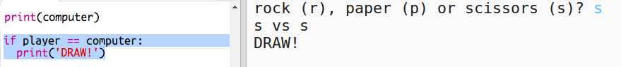
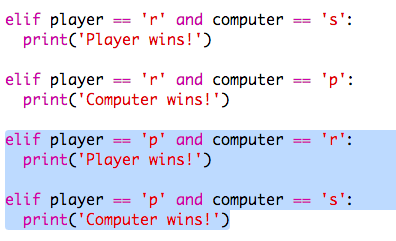

## ಫಲಿತಾಂಶವನ್ನು ಪರಿಶೀಲಿಸಿ

ಈಗ ಯಾರು ಗೆದ್ದರು ಎಂಬುದನ್ನು ನೋಡಲು ಕೋಡ್ ಅನ್ನು ಸೇರಿಸೋಣ.

+ ನೀವು ಯಾರು ಗೆದ್ದರು ಎಂದು ನೋಡಲು `ಆಟಗಾರ(player)` ಮತ್ತು `ಕಂಪ್ಯೂಟರ್(computer)` ಎಂಬ ಅಸ್ಥಿರ ಪದಗಳನ್ನು ಹೋಲಿಸಬೇಕಾಗಿದೆ.
    
    ಒಂದು ವೇಳೆ ಅವು ಒಂದೇ ಆಗಿದ್ದರೆ ಅದು ಡ್ರಾ:
    
    

+ ನೀವು ಡ್ರಾ ಪಡೆಯುವವರೆಗೆ ಕೆಲವು ಬಾರಿ ಆಟವನ್ನು ಆಡುವ ಮೂಲಕ ನಿಮ್ಮ ಕೋಡ್ ಅನ್ನು ಪರೀಕ್ಷಿಸಿ.
    
    ನೀವು ಹೊಸ ಆಟವನ್ನು ಪ್ರಾರಂಭಿಸಲು ` ರನ್(Run) ` ಕ್ಲಿಕ್ ಮಾಡಬೇಕಾಗುತ್ತದೆ.

+ ಈಗ ಆಟಗಾರನು 'r' (ಬಂಡೆ(rock)) ಅನ್ನು ಆಯ್ಕೆ ಮಾಡಿದ ಸಂದರ್ಭಗಳನ್ನು ನೋಡೋಣ ಆದರೆ ಕಂಪ್ಯೂಟರ್ ಮಾಡಲಿಲ್ಲ.
    
    ಒಂದು ವೇಳೆ ಕಂಪ್ಯೂಟರ್ 's' (ಕತ್ತರಿ(scissors)) ಆಯ್ಕೆ ಮಾಡಿದ್ದಲ್ಲಿ ಆಗ ಆಟಗಾರ ಗೆಲ್ಲುತ್ತಾನೆ (ಬಂಡೆ(rock) ಕತ್ತರಿಯನ್ನು(scissors) ಸೋಲಿಸುತ್ತದೆ).
    
    ಒಂದು ವೇಳೆ ಕಂಪ್ಯೂಟರ್ 'p' (ಕಾಗದ(paper)) ಆಯ್ಕೆ ಮಾಡಿದ್ದಲ್ಲಿ ಆಗ ಕಂಪ್ಯೂಟರ್ ಗೆಲ್ಲುತ್ತದೆ(ಕಾಗದ(paper) ಬಂಡೆಯನ್ನು(rock) ಸೋಲಿಸುತ್ತದೆ).
    
    ನಾವು ಆಟಗಾರನ ಆಯ್ಕೆಯನ್ನು *ಮತ್ತು* ಕಂಪ್ಯೂಟರ್ ನ ಆಯ್ಕೆಯನ್ನು `and`ಬಳಸಿಕೊಂಡು ಪರಿಶೀಲಿಸಬಹುದು.
    
    

+ ಮುಂದಿನ ಸಂದರ್ಭಗಳನ್ನು ನೋಡೋಣ, ಎಲ್ಲಿ ಆಟಗಾರನು 'p' (ಕಾಗದ(paper)) ಅನ್ನು ಆಯ್ಕೆ ಮಾಡುತ್ತಾನೆ ಆದರೆ ಕಂಪ್ಯೂಟರ್ ಮಾಡುವುದಿಲ್ಲ:
    
    

+ ಮತ್ತು ಅಂತಿಮವಾಗಿ, ಯಾರು ಗೆದ್ದರು ಎಂದು ಪರಿಶೀಲಿಸಲು ನೀವು ಕೋಡ್ ಅನ್ನು ಸೇರಿಸಬಹುದು ಎಲ್ಲಿ ಆಟಗಾರನು 's'(ಕತ್ತರಿ(scissor)) ಆಯ್ಕೆಮಾಡುತ್ತಾನೆ ಮತ್ತು ಕಂಪ್ಯೂಟರ್ ಬಂಡೆ(rock) ಅಥವಾ ಕಾಗದವನ್ನು(paper) ಆಯ್ಕೆಮಾಡುತ್ತಾದೆ?

+ ನಿಮ್ಮ ಕೋಡ್ ಅನ್ನು ಪರೀಕ್ಷಿಸಲು ಈಗ ಆಟವನ್ನು ಆಡಿ.
    
    
    
    `ರನ್(Run)` ಕ್ಲಿಕ್ ಮಾಡಿ ಹೊಸ ಆಟವನ್ನು ಪ್ರಾರಂಭಿಸಿ.