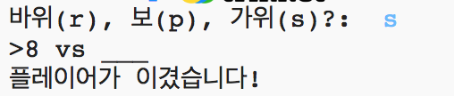

## 소개

이 프로젝트에서는 가위바위보 게임을 만들고, 컴퓨터를 상대로 게임을 진행합니다.

규칙: 컴퓨터와 사용자는 가위, 바위, 보 중 하나를 선택할 수 있습니다. 우승자는 아래의 규칙에 따라 결정됩니다.

* 바위를 냈는데 상대방이 가위를 낸 경우
* 보를 냈는데 상대방이 바위를 낸 경우
* 가위를 냈는데 상대방이 보를 낸 경우

  <iframe src="https://trinket.io/embed/python/673ca8fc0c?outputOnly=true&start=result" width="600" height="500" frameborder="0" marginwidth="0" marginheight="0" allowfullscreen>
  </iframe>
  

### 교육자들을 위한 추가 정보

이 프로젝트를 인쇄하기 위해서는 [프린트용 버전](https://projects.raspberrypi.org/ko-KR/projects/rock-paper-scissors/print)을 사용해 주십시오.

--- collapse---
---
title: 교육자들을 위한 메모
---
## 들어가며:

이 프로젝트에서 아이들은 변수와 조건문을 사용해서 가위바위보 게임을 만드는 방법에 대해 배웁니다.

## 온라인 자료

**이 프로젝트는 파이썬3을 사용합니다.** 파이썬 코드를 온라인에서 작성하기 위해 [Trinket](https://trinket.io/)을 사용하는 것을 권장합니다. 이 프로젝트에 포함된 Trinket은 다음과 같습니다:

* [‘가위바위보’ 게임 -- jumpto.cc/rps-go](http://jumpto.cc/rps-go)

완성된 프로젝트가 저장된 Trinket도 있습니다:

* [완성된 가위바위보 게임 -- trinket.io/python/673ca8fc0c](https://trinket.io/python/673ca8fc0c)

## 오프라인 자료

여러분의 선호에 따라 프로젝트를 [오프라인에서 완성](https://www.codeclubprojects.org/en-GB/resources/python-working-offline/)할 수 있습니다. 'Project Materials' 라는 링크를 클릭하여 이 프로젝트의 자료를 확인해볼 수 있습니다. 이 링크에는 학생들이 프로젝트를 오프라인으로 완료하는 데 필요한 자료가 포함된 'Project Resource' 섹션이 있습니다. 학생들이 이러한 자료의 사본에 접근할 수 있는지 확인하십시오. 이 섹션에는 아래와 같은 파일들이 포함되어 있습니다.

* rock-paper-scissors/rock-paper-scissors.py

이 프로젝트의 완성된 버전은 'Volunteer Resources' 섹션에서 찾을 수 있습니다.

* rock-paper-scissors-finished/rock-paper-scissors.py

(또한 위의 모든 자료는 프로젝트 및 자원봉사자 `.zip` 파일로 다운로드 할 수 있습니다.)

## 학습 목표

* 변수
* 조건문 (`if`, `elif`, `else`); 
* 논리 연산자 `==` and `and`.

이 프로젝트는 [라즈베리파이 디지털 메이킹 커리큘럼](http://rpf.io/curriculum) 중 아래의 과정에 있는 요소들을 다룹니다.

* [기본 프로그래밍 문법으로 간단한 프로그램 만들기](https://www.raspberrypi.org/curriculum/programming/creator)

## 도전과제

* "ASCII art" - 특수문자를 활용하여 가위바위보 그림을 제작합니다. 
* "새로운 게임 만들기" - 가위바위보 게임을 새롭게 제작합니다.

--- /collapse---

--- collapse---
---
title: 프로젝트 자료
---
## 프로젝트 리소스

* [프로젝트의 모든 리소스가 들어있는 .zip 파일](resources/rock-paper-scissors-project-resources.zip)
* [가위바위보 프로젝트 자료가 포함된 온라인 Trinket](http://jumpto.cc/rps-go)
* [rock-paper-scissors/rock-paper-scissors.py](resources/rock-paper-scissors-rock-paper-scissors.py)

## 교육자를 위한 자료

* [완료된 프로젝트 리소스가 담긴 .zip 파일](resources/rock-paper-scissors-volunteer-resources.zip)
* [완성된 온라인 Trinket 프로젝트](https://trinket.io/python/673ca8fc0c)
* [rock-paper-scissors-finished/rock-paper-scissors.py](resources/rock-paper-scissors-finished-rock-paper-scissors.py

--- /collapse---