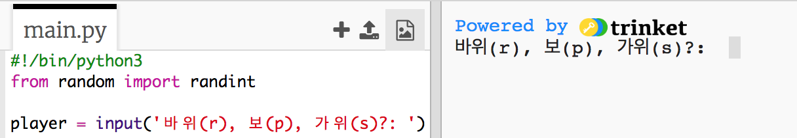
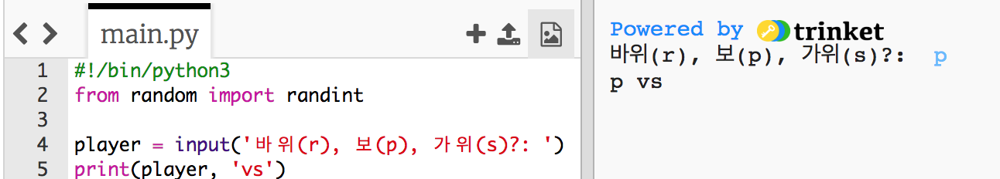

## 플레이어 차례 제작

먼저, 플레이어가 가위, 바위, 보를 선택하도록 합니다.

+ Trinket 파일 열기: <a href="http://jumpto.cc/rps-go" target="_blank">jumpto.cc/rps-go</a>

+ 프로젝트에는 프로젝트 제작 시 필요한 함수가 이미 포함되어 있습니다. 여러분은 이러한 함수를 호출해서 사용하시면 됩니다.
    
    
    
    `randint`를 사용하여, 난수를 생성합니다.

+ 먼저,'s', 'r', 'p' 를 플레이어가 선택할 수 있도록 합니다. s는 scissor로 가위를 의미하며, r은 rock로 바위를 의미하고, p는 paper로 종이(보자기)를 의미합니다.
    
    

+ 플레이어가 선택한 문자열을 출력하십시오.
    
    

+ `Run` 을 클릭하여 프로그램을 테스트하십시오. Trinket의 출력 창에서 's', 'r', 'p' 중 하나를 입력해 보십시오.