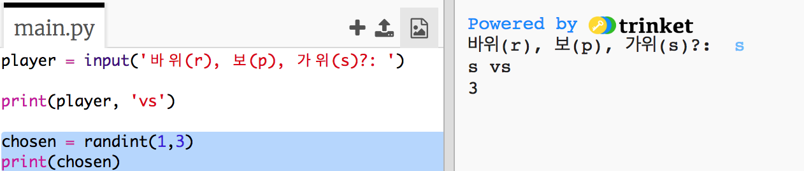
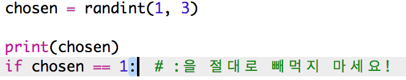
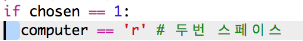
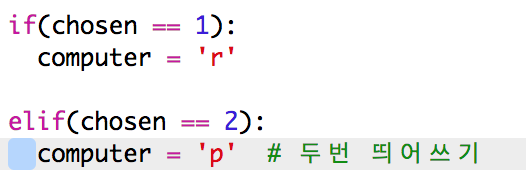
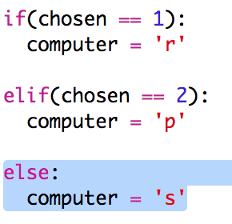
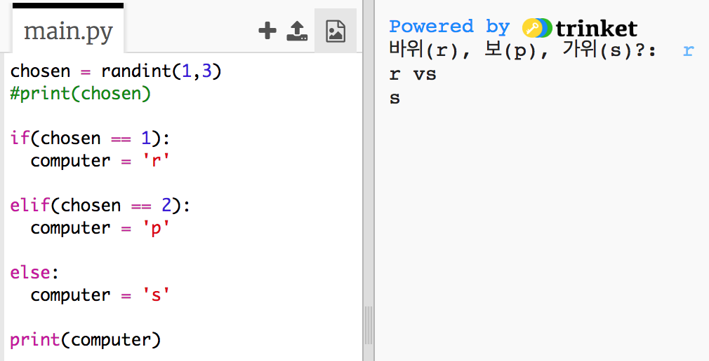
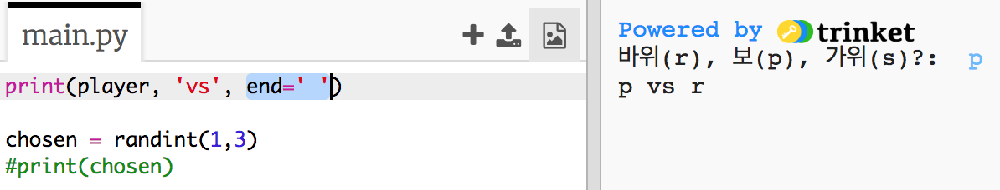

## 컴퓨터의 차례

이제 컴퓨터의 차례입니다. `randint`를 사용하여 난수를 생성할 수 있으며, 이 수로 가위, 바위, 보 중 하나를 결정합니다.

+ `randint`를 사용하여 랜덤 수를 생성하여, 컴퓨터가 가위, 바위, 보 중 하나를 선택하도록 합니다.
    
    

+ 제작한 스크립트를 여러 번 실행하십시오. ('r', 'p', 's'를 매번 입력해야 합니다.)
    
    1, 2, 3이 랜덤하게 생성되는 것을 확인해야 합니다.

+ 숫자는 아래와 같이 정의하겠습니다.
    
    + 1 = 바위 (r)
    + 2 = 보 (p)
    + 3 = 가위 (s)
    
    `if` 를 사용하여 선택한 숫자가 `1` 인지 확인합니다. (`==`은 앞, 뒤에 붙은 두 문자열이 같은지 확인합니다. 
    
    

+ 파이썬은 **들여쓰기** 을 사용하여(오른쪽으로 코드 이동) 프로그램 코드가 `if` 문 안에 포함되어있는지를 확인합니다. 두번 띄어쓰기(스페이스 키를 두번 누릅니다.) 를 하거나, ** 탭 키로** 들여쓰기를 할 수 있습니다. (일반적으로 Caps Lock 키 위에 Tab이 있습니다.)
    
    `computer` 변수 값이 'r'인지 `if` 문으로 확인합니다.
    
    

+ `elif`(*else if* 의 준말) 을 사용하여, 또 다른 추가 확인이 가능합니다.
    
    
    
    이 조건은 첫 번째 조건이 실패한 경우에만 작동합니다. (컴퓨터가 `1`을 선택하지 않은 경우)

+ 컴퓨터가 `1` 또는 `2` 를 선택하지 않은 경우에는, `3`을 선택할 경우일 겁니다.
    
    이는 마지막 조건이므로 `else`문을 활용하면 됩니다.
    
    

+ 이제 컴퓨터가 선택한 숫자를 출력하는 것이 아닌, 컴퓨터가 선택한 문자(가위, 바위, 보)를 출력하도록 합시다.
    
    
    
    `print(chosen)`을 지우거나, 작성한 Code 앞에 `#`을 추가하는 방법으로 작동하지 않게 할 수 있습니다.

+ Run을 클릭하여 코드를 테스트하십시오.

+ 컴퓨터가 선택한 숫자가 새로운 라인에 출력이 되네요... 마음에 안 들죠? 이를 수정하기 위해서는 `vs` 다음에 `end = ' '`을 추가하는 방법으로, 해결할 수 있습니다.
    
    

+ Run을 클릭하고, 게임을 몇 번 해보십시오.
    
    지금은 누가 이겼는지 스스로 확인해야 할 것입니다. 다음 장에서는 이를 파이썬으로 구현해 보겠습니다.