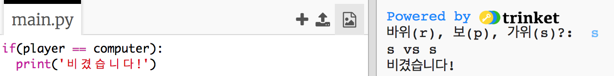
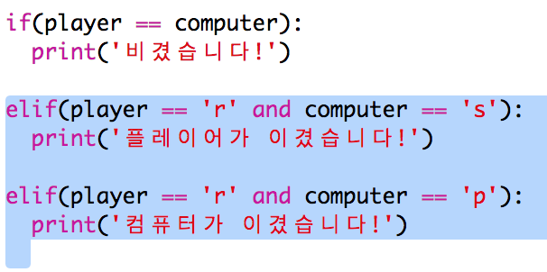
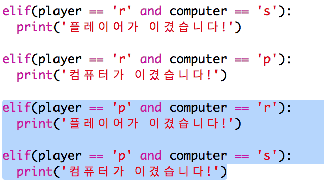
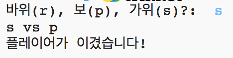

## 결과 확인하기

이제 누가 이겼는지 확인해 봅시다.

+ `player(플레이어)`와 `computer(컴퓨터)` 중 누가 이겼는지 확인해야 합니다.
    
    만약, 둘이 같은 경우 비긴(무승부) 것입니다.
    
    

+ 비길 때까지 코드를 몇 번 실행하십시오.
    
    `Run`을 클릭하여 새로운 게임을 시작합니다.

+ 이번에는 플레이어가 'r'(바위)을 선택하였지만, 컴퓨터는 다른 것을 선택한 경우를 보도록 하겠습니다.
    
    컴퓨터가 's'(가위)를 선택한 경우에는 플레이어가 이긴 경우입니다. (바위는 가위를 때림)
    
    컴퓨터가 'p'(보)를 선택한 경우에는 컴퓨터가 이긴 경우입니다. (보는 바위를 감싸기 때문)
    
    컴퓨터와 플레이어의 선택을 *둘 다* 체크하기 위해서, Python에서는 `and</0>를 사용할 수 있습니다.

</li>
<li>
이번에는 플레이어가 'p'(보)를 선택하였지만, 컴퓨터는 다른 것을 선택한 경우를 보도록 하겠습니다:

</li>
<li>
마지막으로, 플레이어가 's'(가위) 를 선택하고, 컴퓨터가 바위 또는 보를 선택했을 경우 우승자를 확인하는 코드를 추가해 보세요.
</li>
<li>
이제 게임을 실행하여 코드를 테스트하십시오.

<code>Run`을 클릭하여 새로운 게임을 시작합니다.