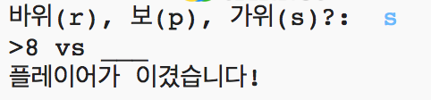
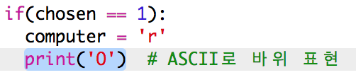
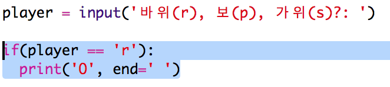

\--- challenge \---

## 과제: ASCII 아트

r, p, s 등의 단어를 사용하는 대신, 이를 ASCII문자로 대체하여 표현해 봅시다.

예시:

가위, 바위, 보를 다음과 같이 표현합니다:

    바위: O
    보: ___
    가위: >8
    
    

+ Instead of saying `print (computer)` you'll need to add a new line to each of the options in the `if` to print out the correct ASCII art. 

힌트:

+ Instead of saying `print (player)` you'll need to add a new if statement to check which item the player chose and print out the correct ASCII art:

힌트 2:

`print` 문에서 `end= ' '` 명령어를 사용하여, 새로운 행 대신에 공백으로 문자열이 끝나도록 하십시오.

+ Include a line to print `vs` between the player and computer results.

    print('vs', end=' ')
    

\--- /challenge \---