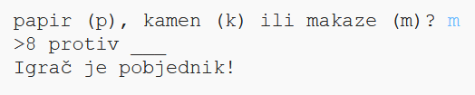

## Uvod

U ovom projektu napravićeš igru Papir, kamen, makaze i igrati je protiv računara.

Pravila: Ti i računar birate papir, kamen ili makaze. Pobjednik se određuje prema ovim pravilima:

* Kamen tupi makaze
* Papir pokriva kamen
* Makaze režu papir

  <iframe src="https://trinket.io/embed/python/f0c38e7199?outputOnly=true&start=result" width="600" height="500" frameborder="0" marginwidth="0" marginheight="0" allowfullscreen>
  </iframe>
  

### Dodatne informacije za vođe kluba

Ukoliko je potrebno da odštampate ovaj projekat, koristite [Verziju za štampu](https://projects.raspberrypi.org/me-ME/projects/rock-paper-scissors/print).

--- collapse ---
---
title: Bilješke za vođe kluba
---
## Uvod:

U ovom projektu djeca će naučiti kako da naprave program koji igra Papir, kamen, makaze koristeći promjenljive i uslovne naredbe.

## Online izvori

**U ovom projektu koristi se Python 3.** Preporučujemo korišćenje [trinketa](https://trinket.io/) za online pisanje u Pythonu. Ovaj projekat sadrži sljedeće Trinkete:

* ['Papir, kamen, makaze' - izvori -- jumpto.cc/rps-go](http://jumpto.cc/rps-go)

Takođe postoji trinket koji sadrži završen projekat:

* [Završen projekat 'Papir, kamen, makaze' -- trinket.io/python/f0c38e7199](https://trinket.io/python/f0c38e7199)

## Offline izvori

Ako želite, ovaj projekat može biti [izrađen offline](https://www.codeclubprojects.org/en-GB/resources/python-working-offline/). Izvorima projekta možete pristupiti klikom na link projekta 'Projektni materijali'. Navedeni link sadrži odjeljak 'Izvori projekta' u kojem se nalaze izvori koji će djeci biti potrebni kako bi izradila ovaj projekat offline. Obezbijedite da svako dijete ima pristup kopiji ovih izvora. Odjeljak sadrži sljedeće datoteke:

* rock-paper-scissors/rock-paper-scissors.py

Takođe, završenu verziju ovoga projekta možete naći u odjeljku 'Izvori za volontere' koji sadrži:

* rock-paper-scissors-finished/rock-paper-scissors.py

(Sve navedene izvore moguće je preuzeti kao `.zip` datoteke.)

## Ciljevi učenja

* Promjenljive;
* Selekcija (`if`, `elif`, `else`); 
* Bulovi operatori `==` i `and`.

Ovim projektom obuhvaćeni su elementi iz sljedećih dijelova [Raspberry Pi Digital Making Curriculum](http://rpf.io/curriculum):

* [Koristite osnovne programske konstrukcije za kreiranje jednostavnih programa.](https://www.raspberrypi.org/curriculum/programming/creator)

## Izazovi

* ''ASCII umjetnost'' - Koristi uslovnu logiku za prikazivanje ASCII umjetnosti za papir, kamen i makaze. 
* ''Napravi novu igru'' - Kopiraj igru Papir, kamen, makaze, izmijeni je i napravi novu igru. 

--- /collapse ---

--- collapse ---
---
title: Projektni materijali
---
## Izvori projekta

* [.zip datoteka koja sadrži sve izvore projekta](resources/rock-paper-scissors-project-resources.zip)
* [Online Trinket koji sadrži sve izvore projekta 'Papir, kamen, makaze'](http://jumpto.cc/rps-go)
* [rock-paper-scissors/rock-paper-scissors.py](resources/rock-paper-scissors-rock-paper-scissors.py)

## Izvori za vođe kluba

* [.zip datoteka koja sadrži sve završene izvore projekta](resources/rock-paper-scissors-volunteer-resources.zip)
* [Završen Trinket projekat online](https://trinket.io/python/f0c38e7199)
* [rock-paper-scissors-finished/rock-paper-scissors.py](resources/rock-paper-scissors-finished-rock-paper-scissors.py)

--- /collapse ---