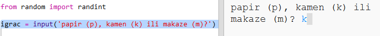

## Igrač je na redu

Za početak, neka igrač odabere papir, kamen ili makaze.

+ Otvori sljedeći trinket: <a href="http://jumpto.cc/rps-go" target="_blank">jumpto.cc/rps-go</a>.

+ Projekat već sadrži kôd za uvoz funkcije koju ćeš koristiti u ovom projektu.
    
    
    
    Kasnije ćeš koristiti `randint` za generisanje slučajnih brojeva.

+ Prvo neka igrač odabere papir, kamen ili makaze tako što će upisati slovo 'p', 'k' ili 'm'.
    
    

+ Sada ispiši ono što je igrač odabrao:
    
    

+ Isprobaj svoj kôd tako što ćeš kliknuti na `Run`. Klikni na izlazni prozor trinketa i unesi svoj izbor.