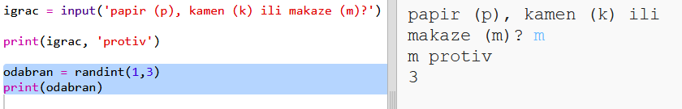
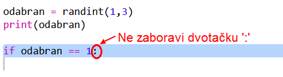
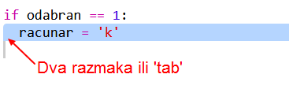
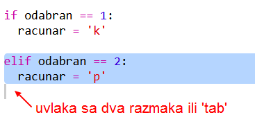
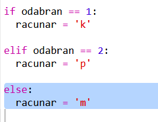
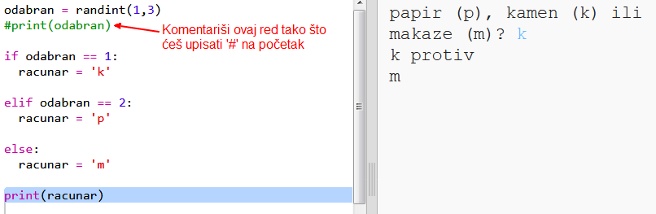
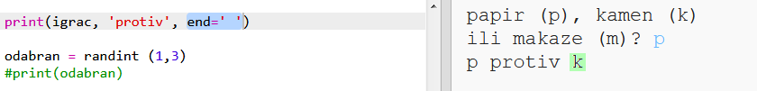

## Računar je na redu

Sada je računar na redu. Možeš da koristiš funkciju `randint` za generisanje slučajnog broja za odabir papira, kamena ili makaza.

+ Koristi `randint` za generisanje slučajnog broja koji će odlučiti da li je računar odabrao papir, kamen ili makaze.
    
    

+ Pokreni svoju skriptu više puta (svaki put treba da uneseš 'p', 'k' ili 'm').
    
    Vidjećeš da je promjenljiva 'odabran' nasumično postavljena na 1, 2 ili 3.

+ Recimo da je:
    
    + 1 = kamen (k)
    + 2 = papir (p)
    + 3 = makaze (m)
    
    Koristi `if` za provjeru da li je odabran broj `1` (`==` se koristi da provjerimo da li su dvije stvari jednake).
    
    

+ Python koristi **uvlačenje** (pomjeranje kôda udesno) da pokaže koji kôd je unutar `if`. Možeš da koristiš dva razmaka (pritisni dva puta taster za razmak) ili da pritisneš **taster Tab** (obično se nalazi iznad CAPSLOCK na tastaturi).
    
    Postavi `racunar` na 'k' unutar `if` koristeći uvlačenje:
    
    

+ Možeš da napraviš dodatnu provjeru koristeći `elif` (skraćenica za *else if*):
    
    
    
    Ovaj uslov će biti provjeravan samo ako prvi uslov ne bude istinit (ako računar nije odabrao `1`).

+ I na kraju, ako računar nije odabrao `1` ili `2`, onda je sigurno odabrao `3`.
    
    Ovaj put možemo jednostavno da koristimo `else` što znači 'inače'.
    
    

+ Sada, umjesto ispisivanja slučajnog broja koji je odabrao računar, možeš da ispišeš slovo.
    
    
    
    Možeš da izbrišeš red `print(odabran)` ili da napraviš da ga računar ignoriše tako što ćeš na početak reda dodati `#`.

+ Isprobaj svoj kôd tako što ćeš kliknuti na Run i izabrati svoju opciju.

+ Hm, izbor računara ispisuje se u novom redu. To možeš popraviti dodavanjem `end=' '` nakon `protiv`, tako da Python zna da treba da završi razmakom, a ne novim redom.
    
    

+ Odigraj igru nekoliko puta tako što ćeš kliknuti na Run i odabrati papir, kamen ili makaze.
    
    Za sada ćeš morati sam/sama da odrediš ko je pobjednik. Uskoro ćeš dodati Python kôd koji će to raditi umjesto tebe.