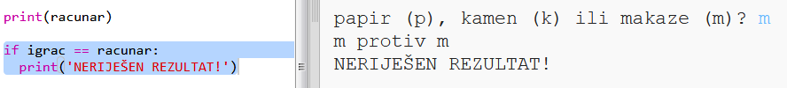
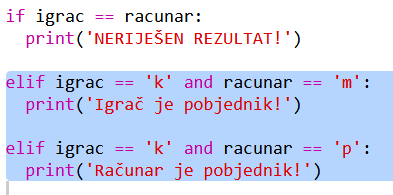
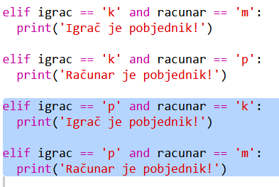
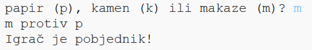

## Provjeri rezultat

Sada dodajmo kôd kako bismo saznali ko je pobijedio.

+ Da bi saznao/saznala ko je pobijedio, treba da uporediš promjenljive `igrac` i `racunar`.
    
    Ako su promjenljive jednake, onda je rezultat neriješen:
    
    

+ Isprobaj svoj kôd igrajući igru nekoliko puta dok ne dobiješ neriješen rezultat.
    
    Klikni na `Run` da započneš novu igru.

+ Sada pogledajmo slučajeve kada je igrač odabrao 'k' (kamen), a računar nije.
    
    Ako je računar odabrao 'm' (makaze), onda je igrač pobjednik (kamen pobjeđuje makaze).
    
    Ako je računar odabrao 'p' (papir), onda je računar pobjednik (papir pobjeđuje kamen).
    
    Možemo da provjerimo izbor igrača *i* izbor računara koristeći `and`.
    
    

+ Pogledajmo sada slučajeve kada je igrač odabrao 'p' (papir), a računar nije:
    
    

+ I na kraju, možeš li da dodaš kôd kojim ćeš provjeriti ko je pobjednik ako je igrač odabrao 'm' (makaze), a računar kamen ili papir?

+ Sada odigraj igru i isprobaj svoj kôd.
    
    
    
    Klikni na `Run` da započneš novu igru.