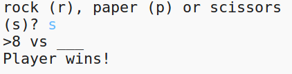

--- challenge ---

## Izazov: ASCII umjetnost

Možeš li, umjesto slova p, k i m, da koristiš ASCII umjetnost za predstavljanje papira, kamena i makaza?

Na primjer:

Gdje je:

    kamen: O
    papir: ___
    makaze: >8
    

+ Umjesto naredbe `print racunar` treba svim opcijama da dodaš novi red unutar `if` kako bi bio ispisan odgovarajući ASCII simbol. 

Pomoć:

+ Umjesto naredbe `print igrac` treba da dodaš novu if naredbu koja će provjeravati šta je igrač odabrao i ispisivati odgovarajući ASCII simbol:

Pomoć:

Ne zaboravi da se dodavanjem `end=' '` na kraju `print` naredbe, naredba završava razmakom, a ne novim redom.

--- /challenge ---