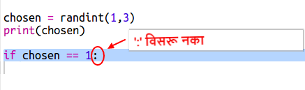
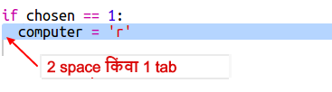
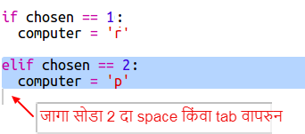
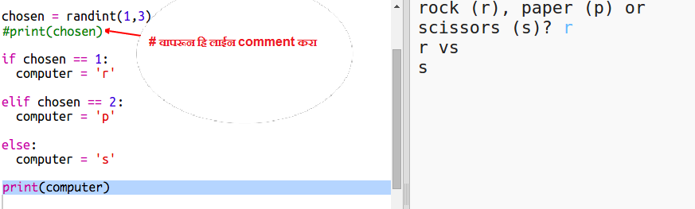

## संगणकाची पाळी

आता संगणकाची पाळी आहे. रँडम संख्या निर्माण करण्यासाठी आपण `randint` function वापरू शकता, जि रॉक, पेपर आणि कात्री यांच्यात निवड करेल.

+ रँडम संख्या निर्माण करण्यासाठी `randint` वापरा ज्याने हे ठरवता येईल कि संगणकाने रॉक, कागद किंवा कात्री यातून काय निवडले आहे.
    
    

+ आपली स्क्रिप्ट बर्‍याच वेळा चालवा (आपल्याला प्रत्येक वेळी 'r', 'p' किंवा 's' प्रविष्ट करणे आवश्यक आहे.)
    
    आपण पाहिले पाहिजे की 'chosen' एकतर 1, 2 किंवा 3 वर सेट केले आहे.

+ असा करू कि:
    
    + 1 = rock (r)
    + 2 = paper (p)
    + 3 = scissors (s)
    
    निवडलेली संख्या `1` आहे की नाही हे तपासण्यासाठी `if` वापरा(`==` 2 गोष्टी समान आहेत की नाही हे पहाण्यासाठी वापरली जाते).
    
    

+ Python **indentation** वापरता (कोडला उजवीकडे हलवता) जे `if` मध्ये कुठला कोड आहे हे दर्शवत. आपण एकतर दोन spaces वापरू शकता (दोनदा spacebar दाबा) किंवा **tab key** (सामान्यतः कीबोर्डवरील capslock च्या वर.)
    
    `if` च्या आत indentation वापरुन `संगणकाला` 'r' सेट करा:
    
    

+ `elif` वापरून आपण वैकल्पिक तपासणी जोडू शकता (*else if* साठी लहान):
    
    
    
    ही अट फक्त तेव्हाच तपासली जाईल जेव्हा पहिली अट अपयशी ठरली (जर संगणकाने `1` निवडली नाही)

+ आणि शेवटी, संगणकाने `1` किंवा `2` निवडले नाही तर त्याने `3` निवडले असावे.
    
    यावेळी आपण फक्त `else` वापरू शकतो याचा अर्थ अन्यथा.
    
    

+ संगणकाने निवडलेला क्रमांक प्रिंट करण्याऐवजी आपण अक्षर प्रिंट करू शकता.
    
    
    
    आपण एकतर `print(chosen)` रेखा हटवू शकता, किंवा ओळीच्या सुरूवातीस `#` जोडून संगणकाला तिला दुर्लक्ष करायला लावु शकता.

+ रन वर क्लिक करून आणि आपला पर्याय निवडून आपल्या कोडची चाचणी करा.

+ हं, संगणकाची निवड एका नवीन ओळीवर प्रिंट होत आहे. आपण ते बरोबर करू शकता `end =' '`हे, `vs` ह्यानंतर जोडा, जे Python ला नवीन ओळीऐवजी स्पेससह समाप्त करण्यास सांगेल.
    
    

+ रन वर क्लिक करून आणि निवड करून काही वेळा गेम खेळा.
    
    आता साध्या आपल्याला स्वत: कोण जिंकले हे ठरवावा लागेल. पुढे हे काम करण्यासाठी Python कोड जोडू.