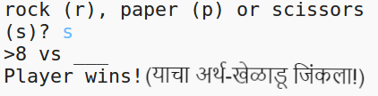
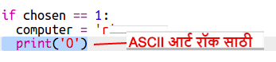

--- challenge ---

## आव्हान: ASCII Art

रॉक, पेपर आणि कात्री यांचे प्रतिनिधित्व करण्यासाठी r, p आणि s अक्षरे वापरण्याऐवजी आपण ASCII Art वापरु शकता का?

उदाहरणार्थ:

जिथे:

    रॉक: O
    पेपर: ___
    कात्री: >8
    

+ `print computer` ऐवजी आपल्याला अचूक ASCII Art प्रिंट करण्यासाठी `if` मधील प्रत्येक पर्यायात नवीन ओळ जोडणे गरजेचे आहे. 

इशारे:

+ `print player` ऐवजी प्लेअरने कोणतं आयटम निवडलं आहे हे तपासण्यासाठी आपल्याला एक नवीन if स्टेटमेंट जोडणे गरजेचं आहे आणि मा योग्य ASCII Art प्रिंट करा:

इशारा:

लक्षात ठेवा `print` च्या शेवटी` end =' '`जोडल्याने तो नवीन लाइनऐवजी स्पेससह समाप्त होतो.

--- /challenge ---