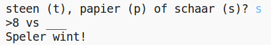

## Invoering

In dit project maak je een Steen, Papier, Schaar-spel en speel je tegen de computer.

Regels: jij en de computer kiezen allebei voor steen, papier of schaar. Deze regels bepalen wie er wint:

* Steen maakt schaar bot
* Papier bedekt steen
* Schaar snijdt papier

  <iframe src="https://trinket.io/embed/python/e1e1d873be?outputOnly=true&start=result" width="600" height="500" frameborder="0" marginwidth="0" marginheight="0" allowfullscreen>
  </iframe>
  

### Aanvullende informatie voor clubleiders

Als je dit project wilt afdrukken, gebruik dan de [ printvriendelijke versie ](https://projects.raspberrypi.org/en/projects/rock-paper-scissors/print).

## \--- collapse \---

## title: Clubleider notities

## Inleiding:

In dit project leren kinderen een programma te maken dat Steen, Papier, Schaar speelt met variabelen en voorwaardelijke stellingen (Engels: 'conditional statements').

## Online bronnen

**Dit project maakt gebruik van Python 3.** We raden aan om [trinket](https://trinket.io/) te gebruiken om Python online te schrijven. Dit project bevat de volgende Trinkets:

* ['Steen, Papier, Schaar' bronnen - jumpto.cc/rps-go](http://jumpto.cc/rps-go)

Er is ook een trinket met het voltooide project:

* ['Steen, Papier, Schaar' gereed - trinket.io/python/e1e1d873be](https://trinket.io/python/e1e1d873be)

## Offline bronnen

Dit project kan [offline worden voltooid](https://www.codeclubprojects.org/en-GB/resources/python-working-offline/) als dit de voorkeur heeft. Je kunt toegang krijgen tot de projectbronnen door op de koppeling 'Projectmaterialen' voor dit project te klikken. Deze link bevat een 'Projectbronnen'-sectie die bronnen bevat om dit project offline te voltooien. Zorg ervoor dat elk kind toegang heeft tot een kopie van deze bronnen. Dit gedeelte bevat de volgende bestanden:

* rock-paper-scissors/rock-paper-scissors.py

Je kunt ook een voltooide versie van dit project vinden in de sectie 'Vrijwilligersbronnen', die het volgende bevat:

* rock-paper-scissors-finished/rock-paper-scissors.py

(Alle bovenstaande bronnen kunnen ook worden gedownload als project en als vrijwilliger `.zip` bestanden.)

## Leerdoelen

* Variabelen;
* Selectie (`als`, `elif`, `anders`); 
* Boolean `==` en `en`.

Dit project behandelt elementen uit de volgende onderdelen van het [Raspberry Pi Digital Making Curriculum](http://rpf.io/curriculum):

* [Gebruik eenvoudige programmeerconstructies om eenvoudige programma's te maken.](https://www.raspberrypi.org/curriculum/programming/creator)

## Uitdagingen

* "ASCII-kunst" - Gebruik voorwaardelijke logica om ASCII-kunst weer te geven voor steen, papier en schaar. 
* "Maak een nieuw spel" - Dupliceer het spel Rock, Paper, Scissors en remix het om een ​​nieuw spel te maken. 

\--- / inklappen \---

## \--- ineenstorting \---

## titel: Projectmaterialen

## Project middelen

* [.zip-bestand met alle projectbronnen](resources/rock-paper-scissors-project-resources.zip)
* [Online Trinket met alle projectbronnen van 'Rock, Paper, Scissors'](http://jumpto.cc/rps-go)
* [rock-paper-scissors / rock-paper-scissors.py](resources/rock-paper-scissors-rock-paper-scissors.py)

## Club leider middelen

* [.zip-bestand met alle voltooide projectresources](resources/rock-paper-scissors-volunteer-resources.zip)
* [Online voltooid Trinket-project](https://trinket.io/python/e1e1d873be)
* [rock-paper-scissors afgewerkte / rock-paper-scissors.py](resources/rock-paper-scissors-finished-rock-paper-scissors.py)

\--- / inklappen \---