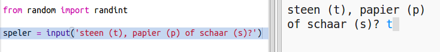
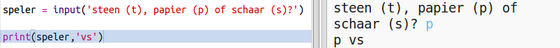

## Speler's beurt

Laat de speler eerst Rock, Paper of Scissors kiezen.

+ Open deze trinket: <a href="http://jumpto.cc/rps-go" target="_blank">jumpto.cc/rps-go</a>.

+ Het project bevat al de code om een ​​functie te importeren die u in dit project gaat gebruiken.
    
    
    
    U zult `randint` later gebruiken om willekeurige getallen te genereren.

+ Laat de speler eerst Rock, Paper of Scissors kiezen door de letter 'r', 'p' of 's' in te typen.
    
    

+ Print nu uit wat de speler heeft gekozen:
    
    

+ Test uw code door te klikken op `Uitvoeren`. Klik in het trinket-uitvoervenster en voer uw keuze in.