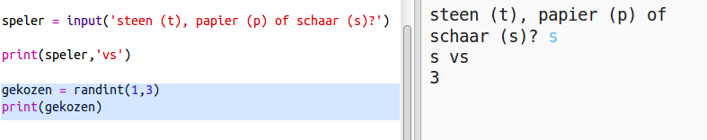
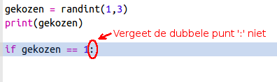
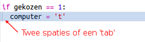
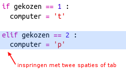
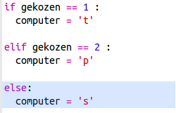
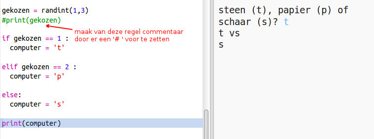
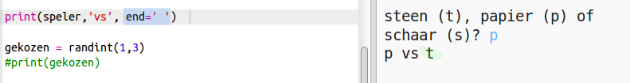

## Computer's beurt

Nu is het de beurt aan de computer. Je kunt de functie `randint` gebruiken om een ​​willekeurig getal te genereren om zo te kiezen tussen steen, papier en schaar.

+ Gebruik `randint` om een ​​willekeurig getal te genereren om te beslissen of de computer steen, papier of een schaar heeft gekozen.
    
    

+ Voer het script een paar keer uit (je steeds weer 't', 'p' of 's' invoeren.)
    
    Je zou moeten zien dat 'gekozen' willekeurig wordt ingesteld op 1, 2 of 3.

+ Laten we zeggen dat:
    
    + 1 = steen (t)
    + 2 = papier (p)
    + 3 = schaar (s)
    
    Gebruik `if` om te controleren of het gekozen nummer `1` is (`==` is om te zien of 2 dingen hetzelfde zijn).
    
    

+ Python gebruikt **inspringing** (de code naar rechts verplaatsen) om aan te geven welke code binnen `if` hoort. Je kunt twee spaties gebruiken (tik twee keer op de spatiebalk) of de **tab-toets** (meestal boven CAPSLOCK op het toetsenbord)
    
    Zet `computer` op 't' binnen `if` door in te springen:
    
    

+ Je kunt een alternatieve controle toevoegen met `elif` (afkorting voor *else if*):
    
    
    
    Deze voorwaarde wordt alleen gecontroleerd als de eerste voorwaarde niet klopt (als de computer niet `1` heeft gekozen)

+ En ten slotte, als de computer niet voor `1` of `2` heeft gekozen, moet het `3` hebben gekozen.
    
    Nu kunnen we gewoon `else` gebruiken, wat 'anders' betekent.
    
    

+ In plaats van dat je het willekeurige getal laat zien dat de computer heeft gekozen, kunt je nu de letter printen.
    
    
    
    Je kunt de regel `print(gekozen)`verwijderen of door de computer laten negeren door er aan het begin van de regel een `#` aan toe te voegen.

+ Test de code door op Run te klikken en je optie te kiezen.

+ Hmm, de keuze van de computer wordt afgedrukt op een nieuwe regel. Je kunt dit oplossen door `end = ''` toe te voegen na `vs`, zodat de zin eindigt met een spatie in plaats van een nieuwe regel.
    
    

+ Speel het spel een paar keer door op Run te klikken en een keuze te maken.
    
    Nu moet je nog zelf uitzoeken wie er gewonnen heeft. Hierna ga je Pythoncode toevoegen om dit te regelen.