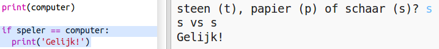
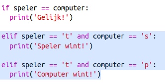
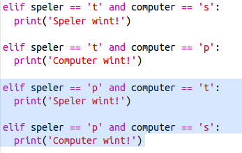
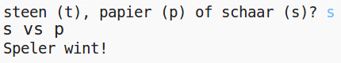

## Controleer het resultaat

Laten we nu de code toevoegen om te zien wie heeft gewonnen.

+ Je moet de `speler` en `computer` variabelen vergelijken om te zien wie er gewonnen heeft.
    
    Als ze hetzelfde zijn, dan is het een gelijkspel:
    
    

+ Test je code door het spel een paar keer te spelen totdat je een gelijkspel hebt.
    
    Je moet op `Uitvoeren` klikken om een ​​nieuw spel te starten.

+ Laten we nu kijken naar de gevallen waarin de speler 'r' (rock) koos, maar de computer niet.
    
    Als de computer 's' (schaar) kiest, wint de speler (rock beats scissors).
    
    Als de computer 'p' (papier) kiest, wint de computer (papier verslaat rock).
    
    We kunnen de keuze van de speler *en* de computerkeuze controleren met `en`.
    
    

+ Laten we vervolgens kijken naar de gevallen waarin de speler 'p' (papier) koos, maar de computer niet:
    
    

+ En tot slot kun je de code toevoegen om de winnaar te controleren wanneer de speler 's' (scharen) koos en de computer voor rock of papier koos?

+ Speel nu het spel om je code te testen.
    
    
    
    Klik op `Run` om een ​​nieuwe game te starten.