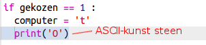
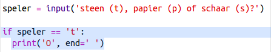

\--- challenge \---

## Uitdaging: ASCII kunst

Kun je ASCII-kunst gebruiken In plaats van de letters t, p en s voor steen, papier en schaar?

Bijvoorbeeld:

Waarbij:

    steen: O papier: ___ schaar: >8
    

+ In plaats van `print computer` te gebruiken, moet je een nieuwe regel toevoegen aan elk van de opties in `if` om de juiste ASCII-kunst af te drukken. 

Hints:

+ In plaats van `print speler` te gebruiken, moet je een nieuw if-statement toevoegen om te controleren welk ding de speler heeft gekozen om dan de juiste ASCII-art af te drukken:

Hint:

Vergeet niet dat het toevoegen van `end = ''` aan het einde van een `print` ervoor zorgt dat het eindigt met een spatie in plaats van een nieuwe regel.

\--- /challenge \---