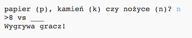

## Wprowadzenie

W tym projekcie stworzysz grę Papier, Kamień, Nożyce i zagrasz przeciwko komputerowi.

Zasady gry: Ty i komputer wybieracie kamień, papier albo nożyce. Zwycięzcę wybieramy według następujących zasad:

* Kamień tępi nożyce
* Papier owija kamień
* Nożyce tną papier

 <iframe src="https://trinket.io/embed/python/6808937e14?outputOnly=true&start=result" width="600" height="500" frameborder="0" marginwidth="0" marginheight="0" allowfullscreen></iframe>
  

### Dodatkowe informacje dla liderów klubów

Jeśli chcesz wydrukować ten projekt, użyj [wersji do druku](https://projects.raspberrypi.org/en/projects/rock-paper-scissors/print).

--- collapse ---
---
title: Dla lidera klubu
---

## Wprowadzenie

W tym projekcie dzieci dowiedzą się, jak stworzyć program, który gra w Papier, Kamień, Nożyce. Użyją do tego zmiennych i instrukcji warunkowych.

## Zasoby Online

**Ten projekt używa języka Python 3.** Do pisania kodu w Pythonie zalecamy użycie edytora [trinket](https://trinket.io/). Ten projekt zawiera następujące szablony:

* [Szablon startowy "Papier, Kamień, Nożyce" -- jumpto.cc/rps-go](http://jumpto.cc/rps-go)

Dostępny jest też szablon zawierający ukończony projekt:

* [Ukończony projekt "Papier, Kamień, Nożyce" -- trinket.io/python/6808937e14](https://trinket.io/python/6808937e14)

## Zasoby Offline

Ten projekt można także [wykonać offline](https://www.codeclubprojects.org/en-GB/resources/python-working-offline/). Materiały potrzebne do wykonania projektu dostępne są po kliknięciu linku "Materiały do projektu". Można znaleźć tam sekcję "Źródła", która zawieraj zasoby, potrzebne dzieciom do wykonania projektu w wersji offline. Upewnij się, że każde dziecko ma dostęp do tych zasobów. Ta sekcja zawiera następujące pliki:

* rock-paper-scissors/rock-paper-scissors.py

Pełną wersję tego projektu można również znaleźć w sekcji "Zasoby dla wolontariuszy", która zawiera:

* rock-paper-scissors-finished/rock-paper-scissors.py

(Wszystkie powyższe zasoby można również pobrać jako pliki `.zip`.)

## Cele dydaktyczne

* Zmienne
* Wybór (`if`, `elif`, `else`) 
* Logika boolowska (`==` i `and`)

Ten projekt obejmuje elementy z następujących wątków z [Raspberry Pi Digital Making Curriculum](http://rpf.io/curriculum):

* [Użycie podstawowych konstrukcji programistycznych do tworzenia prostych programów.](https://www.raspberrypi.org/curriculum/programming/creator)

## Wyzwania

* "ASCII art" - Użycie instrukcji warunkowych, aby wyświetlić ASCII art dla kamienia, papieru i nożyc. 
* "Stwórz nową grę" - Skopiowanie gry Papier, Kamień, Nożyce i przerobienie jej w taki sposób, aby stworzyć nową grę. 

--- /collapse ---

--- collapse ---
---
title: Materiały do projektu
---
## Zasoby

* [Plik .zip zawierający wszystkie zasoby potrzebne do wykonania projektu](resources/rock-paper-scissors-project-resources.zip)
* [Szablon startowy "Papier, Kamień Nożyce"](http://jumpto.cc/rps-go)
* [rock-paper-scissors/rock-paper-scissors.py](resources/rock-paper-scissors-rock-paper-scissors.py)

## Zasoby dla lidera klubu

* [Plik .zip zawierający zasoby z ukończonym projektem](resources/rock-paper-scissors-volunteer-resources.zip)
* [Ukończony projekt "Papier, Kamień, Nożyce"](https://trinket.io/python/6808937e14)
* [rock-paper-scissors-finished/rock-paper-scissors.py](resources/rock-paper-scissors-finished-rock-paper-scissors.py)

--- /collapse ---
