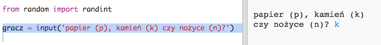
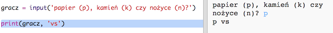

## Ruch gracza

W pierwszej kolejności gracz wybiera papier, kamień lub nożyczki.

+ Otwórz ten szablon: <a href="http://jumpto.cc/rps-go" target="_blank">jumpto.cc/rps-go</a>.

+ Projekt zawiera już kod importujący funkcję, której będziesz używać w tym projekcie.
    
    
    
    Później będziesz używać funkcji `randint` do generowania liczb losowych.

+ Najpierw pozwól graczowi wybrać Kamień, Papier albo Nożyce, wpisując literę "k", "p" lub "n".
    
    

+ Teraz wyświetl na ekranie to, co wybrał gracz:
    
    

+ Przetestuj swój kod klikając przycisk `Run`. Kliknij okno po prawej stronie edytora i wpisz, co wybrałeś.