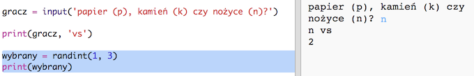
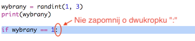
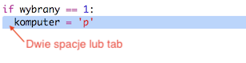
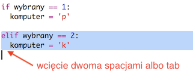
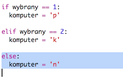
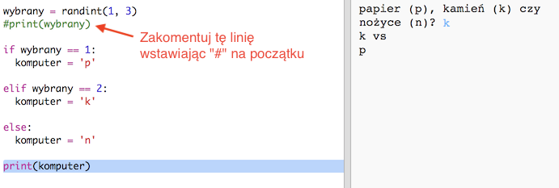
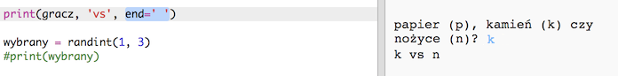

## Ruch komputera

Teraz kolej na komputer. Możesz użyć funkcji `randint` do generowania liczby losowej, aby wybrać papier, kamień lub nożyce.

+ Użyj `randint` do wygenerowania losowej liczby, aby zdecydować, czy komputer wybrał papier, kamień czy nożyce.
    
    

+ Uruchom swój skrypt wiele razy (za każdym razem wpisz "p", "k" lub "n").
    
    Wartość zmiennej "wybrany" będzie wybierana losowo jako 1, 2 lub 3.

+ Powiedzmy, że:
    
    + 1 = papier (p)
    + 2 = kamień (k)
    + 3 = nożyce (n)
    
    Użyj `if` do sprawdzenia, czy wybrana liczba to `1` (do sprawdzenia, czy dwie rzeczy są takie same używamy `==`).
    
    

+ Python używa **wcięcia** (przesunięcie kodu w prawo), aby pokazać, który kod znajduje się wewnątrz `if`. Możesz użyć dwóch spacji (naciśnij dwa razy spację), albo naciśnij klawisz **Tab** (zazwyczaj znajduje się na klawiaturze nad klawiszem CAPSLOCK).
    
    Ustaw `komputer` na "r" wewnątrz `if` używając do tego wcięcia:
    
    

+ Możesz dodać alternatywne sprawdzenie używając `elif` (skrót od angielskiego *else if*, czyli "w przeciwnym razie, jeżeli"):
    
    
    
    Ten warunek zostanie sprawdzony tylko wtedy, gdy pierwszy warunek nie zostanie spełniony (czyli jeśli komputer nie wybrał `1`)

+ Jeśli komputer nie wybrał ani `1` ani `2`, to znaczy, że musiał wybrać `3`.
    
    Tym razem możemy po prostu użyć `else`, co oznacza "w przeciwnym przypadku".
    
    

+ Teraz, zamiast wyświetlać losową liczbę, którą wybrał komputer, możesz wyświetlić literę.
    
    
    
    Możesz usunąć polecenie `print(wybrany)` albo dodać przed nim `#`, aby sprawić, że komputer je zignoruje.

+ Przetestuj swój kod klikając Run i wybierając papier, kamień albo nożyce.

+ Hmm, wybór komputera jest wyświetlany w nowej linii. Możesz to naprawić, dodając `end=' '` po `vs`, co powie Pythonowi, by kończył spacją, a nie nową linią.
    
    

+ Zagraj kilka razy klikając Run i wybierając papier, kamień albo nożyce.
    
    Póki co to Ty musisz ustalać, kto wygrał. Teraz dodamy kod w Pythonie, który sam to sprawdzi.