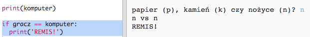
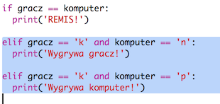
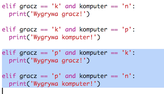
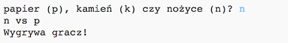

## Sprawdzanie wyniku

Teraz dodajmy kod, który sprawdzi, kto wygrał.

+ Musisz porównać zmienne `gracz` i `komputer`, aby ustalić, kto wygrał.
    
    Jeśli są takie same, to jest remis:
    
    

+ Przetestuj swój kod grając kilka razy, aż będzie remis.
    
    Musisz kliknąć przycisk `Run`, aby rozpocząć nową rundę.

+ Teraz spójrzmy na przypadki, w których gracz wybrał "k" (kamień), a komputer coś innego.
    
    Jeśli komputer wybrał "n" (nożyczki), wygrywa gracz (kamień niszczy nożyczki).
    
    Jeśli komputer wybrał "p" (papier), komputer wygrywa (papier pokonuje kamień).
    
    Możemy sprawdzić wybór gracza *i* wybór komputera za pomocą `and`.
    
    

+ Następnie spójrzmy na przypadki, w których gracz wybrał "p" (papier), a komputer coś innego:
    
    

+ Czy umiesz dodać kod, który sprawdzi, kto zwyciężył, jeśli gracz wybrał "n" (nożyczki), a komputer wybrał kamień lub papier?

+ Teraz zagraj, aby przetestować swój kod.
    
    
    
    Kliknij przycisk `Run`, aby rozpocząć nową rundę.