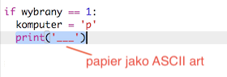
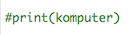
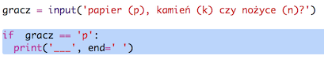

--- challenge \---

## Wyzwanie: ASCII Art

Czy potrafisz użyć ASCII art do reprezentowania papieru, kamienia i nożyczek zamiast używać liter p, k i n?

Na przykład:

Gdzie:

    paper: ___
    kamień: O
    nożyczki: >8
    

+ Zamiast wyświetlać `print(komputer)` musisz dodać nową linię do każdej z opcji w `if`, aby wyświetlić poprawny ASCII art. 

Wskazówka:

+ Zamiast wyświetlać `print(gracz)` musisz doddać nową instrukcję if, która sprawdzi, co wybrał gracz i wyświetli odpowiedni ASCII art:

Wskazówka:

Pamiętaj, że dodanie `end=''` na końcu polecenia `print` powoduje, że wyświetlanie kończy się spacją, a nie nową linią.

--- /challenge ---
