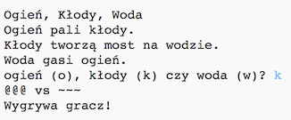

--- challenge ---

## Wyzwanie: stwórz nową grę

Czy potrafisz stworzyć własną grę, taką jak Papier, Kamień, Nożyce, ale z innymi przedmiotami?

Kliknij przycisk "Duplicate", aby utworzyć kopię projektu Papier, Kamień, Nożyce.

W tym przykładzie użyliśmy ogień, kłody i wodę:

--- /challenge ---

### Tłumaczenie wykonane przez wolontariuszy

Projekt został przetłumaczony przez **Wojtek Zieliński**.

Dzięki naszym wspaniałym wolontariuszom, dzieci na całym świecie mogą nauczyć się kodowania. Tłumacząc nasze projekty możesz pomóc nam dotrzeć do większej liczby dzieci. Więcej informacji na stronie rpf.io/translators.
