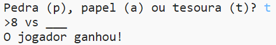

## Introdução

Neste projeto você fará um jogo Pedra, Papel e Tesoura e jogará contra o computador.

Regras: Você e o computador escolhem entre pedra, papel ou tesoura. O vencedor é decidido por estas regras:

* A pedra quebra a tesoura
* O papel embrulha a pedra
* A tesoura corta o papel

  <iframe src="https://trinket.io/embed/python/ed6cec2815?outputOnly=true&start=result" width="600" height="500" frameborder="0" marginwidth="0" marginheight="0" allowfullscreen>
  </iframe>
  

### Informação adicional para líderes de clubes

Se você precisar imprimir este projeto, use a [versão para impressão](https://projects.raspberrypi.org/pt-BR/projects/rock-paper-scissors/print).

--- collapse ---
---
title: Notas do líder do clube
---

## Introdução:

Neste projeto, as crianças aprenderão como fazer um jogo do tipo Pedra, Papel e Tesoura usando variáveis ​​e instruções condicionais.

## Recursos Online

**Este projeto usa o Python 3.** Recomendamos usar [trinket](https://trinket.io/) para escrever Python online. Este projeto contém os seguintes Trinkets:

* [Recursos do 'Pedra, Papel e Tesoura' - jumpto.cc/rps-go](http://jumpto.cc/rps-go)

Há também um trinket contendo o projeto concluído:

* ['Pedra, Papel e Tesoura' terminado - trinket.io/python/e1e1d873be](https://trinket.io/python/ed6cec2815)

## Recursos Offline

Este projeto pode ser [concluído off-line](https://www.codeclubprojects.org/en-GB/resources/python-working-offline/) , se preferir. Você pode acessar os recursos do projeto clicando no link 'Materiais do Projeto' para este projeto. Este link contém uma seção 'Recursos do Projeto', que inclui recursos que as crianças precisarão para concluir esse projeto off-line. Certifique-se de que cada criança tenha acesso a uma cópia desses recursos. Esta seção inclui os seguintes arquivos:

* pedra-papel-tesoura/rock-paper-scissors.py

Você também pode encontrar uma versão completa deste projeto na seção 'Recursos para Voluntários', que contém:

* pedra-papel-tesoura-acabado/rock-paper-scissors.py

(Todos os recursos acima também podem ser baixados como arquivos `.zip` do projeto e dos voluntários.)

## Objetivos de aprendizado

* Variáveis;
* Seleção (`if`, `elif`, `else`); 
* Booleana `==` e `e`.

Este projeto abrange elementos das seguintes vertentes do [Currículo de Criação Digital Raspberry Pi](http://rpf.io/curriculum):

* [Usar estruturas básicas de programação para criar programas simples.](https://www.raspberrypi.org/curriculum/programming/creator)

## Desafios

* "Arte ASCII" - Use lógica condicional para exibir arte ASCII para pedra, papel e tesoura. 
* "Criar um novo jogo" - Duplique o jogo Pedra, Papel e Tesoura e remixe-o para criar um novo jogo. 

--- /collapse ---

--- collapse ---
---
title: Materiais do Projeto
---

## Recursos do Projeto

* [arquivo .zip contendo todos os recursos do projeto](resources/rock-paper-scissors-project-resources.zip)
* [Online Trinket contendo todos os recursos do projeto 'Pedra, Papel e Tesoura'](http://jumpto.cc/rps-go)
* [pedra-papel-tesoura/rock-paper-scissors.py](resources/rock-paper-scissors-rock-paper-scissors.py)

## Recursos para líderes de clube

* [arquivo .zip contendo todos os recursos do projeto concluídos](resources/rock-paper-scissors-volunteer-resources.zip)
* [Projeto Trinket concluído online](https://trinket.io/python/ed6cec2815)
* [pedra-papel-tesoura-acabado/rock-paper-scissors.py](resources/rock-paper-scissors-finished-rock-paper-scissors.py)

--- /collapse ---