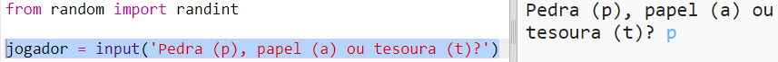
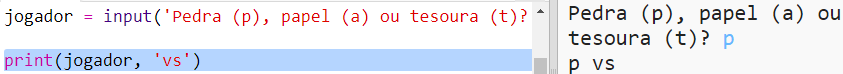

## Turno do Jogador

Primeiro, deixe o jogador escolher entre Pedra, Papel ou Tesoura.

+ Abra este trinket: <a href="http://jumpto.cc/rps-go" target="_blank">jumpto.cc/rps-go</a>.

+ O projeto já contém o código para importar a função que você usará neste projeto.
    
    
    
    Você usará `randint` posteriormente para gerar números aleatórios.

+ Primeiro, deixe o jogador escolher entre Pedra, Papel ou Tesoura, digitando a letra 'p', 'a' ou 't'.
    
    

+ Agora imprima o que o jogador escolheu:
    
    

+ Teste seu código clicando em `Run`. Clique na janela de saída do trinket e insira sua escolha.